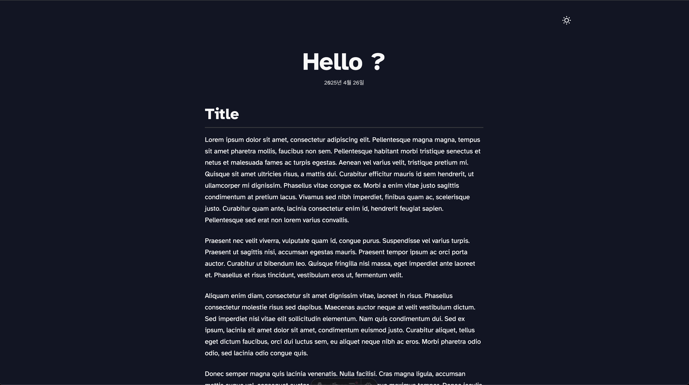

# Minimal Blog Template



## How to use

### 블로그 글 작성하기

#### 자동 생성 명령어 사용 (권장)

```bash
# 기본 사용법
npm run post:new -- <filename>

# 태그와 함께 생성
npm run post:new -- <filename> --tags=tag1,tag2,tag3

# 예시
npm run post:new -- next-middleware --tags=nextjs,middleware
npm run post:new -- react-tutorial --tags=react,javascript,tutorial
```

이 명령어는 `src/content/notes/` 디렉토리에 다음과 같은 형식의 파일을 자동으로 생성합니다:

```markdown
---
title: Next Middleware
draft: true
publishedAt: 2025-07-10
tags:
  - nextjs
  - middleware
---

# Next Middleware

Write your content here...
```

#### 수동으로 파일 생성하기

1. `src/content/notes` 디렉토리에 새로운 마크다운 파일을 생성합니다.
2. 다음과 같은 형식으로 파일 상단에 frontmatter를 추가합니다:

```markdown
---
title: "글 제목"
draft: false
publishedAt: 2025-05-10
tags: 
  - 태그1
  - 태그2
---

여기에 본문 내용을 작성합니다.
```

### 사이트 설정 변경하기

`src/config.ts` 파일을 수정하여 다음 설정을 변경할 수 있습니다:

- 사이트 제목
- 사이트 설명
- 기본 언어
- 기본 URL
- 작성자 이름
