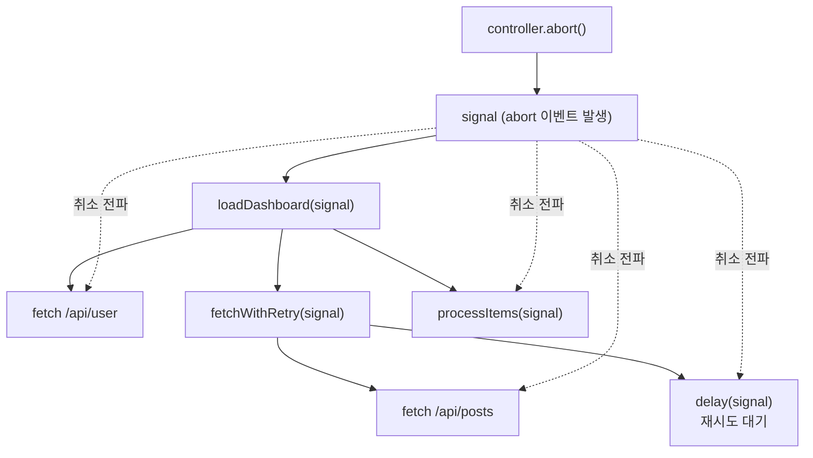

비동기 프로그래밍에서 가장 까다로운 문제 중 하나는 시작하는 것이 아니라 **멈추는 것**입니다. 사용자가 검색어를 빠르게 바꿀 때 이전 요청은 더 이상 필요 없습니다. 컴포넌트가 언마운트되면 진행 중이던 fetch는 버려져야 합니다. 모달을 닫으면 그 안에서 돌던 작업도 중단되어야 합니다.

그런데 여기서 근본적인 벽에 부딪힙니다. **프로미스에는 `cancel` 메서드가 없습니다.**

```javascript
const promise = fetch('/api/search?q=react');
promise.cancel(); // ❌ 그런 건 없다
```

프로미스는 일방통행입니다. 한번 시작하면 `fulfilled`나 `rejected`로 정착할 때까지 외부에서 흐름에 개입할 방법이 없습니다. 이전 글들에서 프로미스를 "상태 머신"으로 다뤘는데, 그 상태 머신에는 외부에서 누를 수 있는 정지 버튼이 애초에 설계되어 있지 않은 것입니다.

이 글은 그 정지 버튼을 *바깥에서* 만들어 끼우는 표준 메커니즘, **`AbortController`**를 다룹니다. 그리고 단순한 사용법을 넘어, 하나의 취소 신호가 어떻게 깊은 호출 트리를 타고 *전파*되는지에 집중합니다.

## 신호를 분리하라: 컨트롤러와 시그널

`AbortController`의 설계는 두 개의 객체로 책임을 나눕니다.

```javascript
const controller = new AbortController();
const signal = controller.signal;

// controller: 취소를 "발동"하는 쪽 (리모컨)
// signal: 취소 여부를 "관찰"하는 쪽 (읽기 전용 수신기)

controller.abort(); // 발동
console.log(signal.aborted); // true
```

이 분리가 핵심입니다. `controller`는 `abort()`라는 트리거를 쥐고 있고, `signal`은 그 상태를 읽기만 하는 관찰 가능한 객체입니다. **취소를 발동할 권한과 취소를 감지할 권한을 분리**한 것입니다.

이전 글의 Deferred 패턴을 기억한다면 구조가 똑같다는 걸 알아챘을 것입니다. Deferred는 프로미스의 `resolve`/`reject`를 외부로 빼내 "상태를 결정하는 리모컨"을 만들었습니다. `AbortController`는 정확히 같은 발상을 취소에 적용합니다 — `abort()`는 외부로 빼낸 리모컨이고, `signal`은 그 리모컨에 반응하는 수신기입니다. 그래서 신호를 만든 곳과 신호를 소비하는 곳이 시공간적으로 떨어져 있어도 됩니다.

`signal`은 두 가지 방식으로 취소를 알립니다.

```javascript
// 1. 동기적 폴링: 지금 취소됐나?
if (signal.aborted) { /* ... */ }

// 2. 이벤트: 취소되는 순간 알림
signal.addEventListener('abort', () => {
  console.log('취소됨! 이유:', signal.reason);
});
```

`signal`은 사실 `EventTarget`입니다. 그래서 `abort` 이벤트를 발생시키는 이벤트 발신기처럼 동작합니다. 이 "이벤트로 전파된다"는 성질이 뒤에서 다룰 신호 전파의 토대가 됩니다.

## fetch와의 통합: 표준이 이미 알고 있는 신호

`AbortController`가 강력한 이유는, 플랫폼의 비동기 API들이 이미 `signal`을 받도록 표준화되어 있기 때문입니다. `fetch`가 대표적입니다.

```javascript
const controller = new AbortController();

const promise = fetch('/api/search?q=react', {
  signal: controller.signal, // 신호를 넘긴다
});

// 어딘가에서 취소가 발동되면
controller.abort();

// fetch는 거부된다
promise.catch((err) => {
  if (err.name === 'AbortError') {
    console.log('요청이 취소되었습니다');
  }
});
```

`abort()`가 호출되면 fetch는 즉시 거부되는데, 이때 던져지는 에러는 `name`이 `'AbortError'`인 `DOMException`입니다. 그래서 취소로 인한 실패와 *진짜* 네트워크 실패를 구분하려면 `err.name`을 확인해야 합니다. 이 구분은 실무에서 중요합니다 — 취소는 사용자 의도에 의한 정상 흐름이지 에러 화면을 띄울 상황이 아니기 때문입니다.

`signal.reason`을 쓰면 취소 사유까지 전달할 수 있습니다.

```javascript
controller.abort(new Error('사용자가 검색어를 변경함'));
// signal.reason === 그 Error 객체
```

## 내가 만든 비동기 함수도 취소 가능하게

표준 API뿐 아니라 우리가 직접 만든 비동기 작업도 신호에 반응하게 만들 수 있습니다. 패턴은 두 가지입니다. **이벤트로 듣거나, 폴링으로 확인하거나.**

```javascript
function delay(ms, signal) {
  return new Promise((resolve, reject) => {
    // 이미 취소된 신호라면 즉시 거부
    if (signal?.aborted) {
      return reject(signal.reason);
    }

    const timer = setTimeout(resolve, ms);

    // 취소되면 타이머를 정리하고 거부
    signal?.addEventListener(
      'abort',
      () => {
        clearTimeout(timer); // ← 리소스 정리가 핵심
        reject(signal.reason);
      },
      { once: true }, // 한 번만 듣고 자동 해제
    );
  });
}
```

여기서 두 가지가 중요합니다. 첫째, `abort` 이벤트를 받으면 단순히 거부만 하는 게 아니라 **실제 자원(여기선 타이머)을 정리**해야 합니다. 취소의 목적이 바로 불필요한 작업을 멈추는 것이니까요. 둘째, `{ once: true }` 옵션입니다. 신호가 오래 사는 객체라면 리스너를 제때 떼지 않을 경우 누수가 됩니다.

루프처럼 중간중간 확인할 지점이 있는 작업이라면, 표준이 제공하는 `throwIfAborted()`로 폴링하는 편이 깔끔합니다.

```javascript
async function processItems(items, signal) {
  for (const item of items) {
    signal?.throwIfAborted(); // 취소됐으면 여기서 즉시 throw
    await heavyWork(item);
  }
}
```

## 핵심: 하나의 신호, 여러 작업으로의 전파

이제 이 글의 진짜 주제입니다. `AbortController`의 진정한 힘은 단일 작업 취소가 아니라, **하나의 신호를 트리 전체에 흘려보내는 전파**에 있습니다.

같은 `signal`을 여러 작업에 동시에 넘기면, `abort()` 한 번으로 전부가 취소됩니다.

```javascript
async function loadDashboard(signal) {
  // 같은 신호를 여러 fetch에 공유
  const [user, posts, notifications] = await Promise.all([
    fetch('/api/user', { signal }),
    fetch('/api/posts', { signal }),
    fetch('/api/notifications', { signal }),
  ]);
  return { user, posts, notifications };
}

const controller = new AbortController();
loadDashboard(controller.signal);

// 단 한 번의 abort()로 세 요청이 모두 취소된다
controller.abort();
```

더 나아가 신호는 호출 트리의 깊은 곳까지 *전달되며 흐릅니다*. 상위 함수가 받은 `signal`을 하위 함수로 계속 넘기기만 하면, 루트에서의 단 한 번의 취소가 모든 잎(leaf) 작업까지 도달합니다.



`signal`을 함수 인자로 계속 아래로 넘기는 이 관례가 전파의 전부입니다. 신호는 위에서 아래로 흐르고, 취소는 단 한 지점에서 발동되어 모든 구독자에게 동시에 도달합니다.

## 신호를 합성하기: AbortSignal.any와 timeout

현실에서는 취소 사유가 여럿일 때가 많습니다. "사용자가 취소했거나, *또는* 5초가 지났거나." 이를 위해 표준은 신호를 합성하는 도구를 제공합니다.

```javascript
const userController = new AbortController();

const combined = AbortSignal.any([
  userController.signal,        // 사용자 취소
  AbortSignal.timeout(5000),    // 5초 타임아웃
]);

fetch('/api/data', { signal: combined });
// userController.abort() 가 불리거나, 5초가 지나거나
// 둘 중 먼저 발생하는 쪽에 의해 취소된다
```

`AbortSignal.any([...])`는 입력 신호 중 *하나라도* 취소되면 함께 취소되는 새 신호를 만듭니다(`Promise.race`의 취소 버전인 셈입니다). `AbortSignal.timeout(ms)`는 지정 시간 후 자동으로 취소되는 신호를 만들어 줍니다. 이 둘을 조합하면 "사용자 취소 + 타임아웃 + 부모로부터 물려받은 취소"를 하나의 신호로 묶어 하위로 흘려보낼 수 있습니다. 전파 트리의 각 노드가 자신만의 취소 조건을 부모의 신호에 *덧붙이는* 구조입니다.

## TanStack Query는 이것을 어떻게 쓰는가

첫 글에서 Retryer가 "취소"를 다룬다고 했고, fetch가 오프라인 시 일시정지된다고 했습니다. 그 취소의 실체가 바로 `AbortController`입니다.

TanStack Query는 **각 쿼리 fetch마다 내부적으로 `AbortController`를 하나씩 만들고**, 그 `signal`을 `queryFn`에 인자로 넘겨줍니다.

```javascript
useQuery({
  queryKey: ['search', term],
  queryFn: ({ signal }) => {
    // 라이브러리가 만들어 준 signal을 fetch로 전달
    return fetch(`/api/search?q=${term}`, { signal }).then((r) => r.json());
  },
});
```

이제 그림이 맞춰집니다. 컴포넌트가 언마운트되거나, 같은 쿼리가 새 인자로 다시 실행되면(예: 검색어 변경), 라이브러리는 이전 fetch의 컨트롤러에 대해 `abort()`를 호출합니다. 그러면 진행 중이던 낡은 요청이 취소되고, `AbortError`는 라이브러리가 알아서 걸러내 에러로 취급하지 않습니다. 우리가 이 글에서 손으로 조립한 전파 메커니즘을, TanStack Query는 쿼리 생명주기에 자동으로 엮어둔 것입니다.

## 정리: 바깥에서 끼우는 정지 버튼

프로미스에는 정지 버튼이 없습니다. `AbortController`는 그 정지 버튼을 *바깥에서* 만들어, 비동기 작업에 끼워 넣는 표준 메커니즘입니다.

- **컨트롤러와 시그널의 분리** — 취소를 발동하는 권한과 감지하는 권한을 나눈다 (Deferred 패턴의 취소판).
- **이벤트 기반 전파** — `signal`은 `EventTarget`이라 `abort` 이벤트로 모든 구독자에게 동시에 알린다.
- **인자로 흐르는 신호** — 같은 `signal`을 호출 트리 아래로 계속 넘기면, 루트의 단 한 번의 `abort()`가 모든 잎까지 전파된다.
- **합성** — `AbortSignal.any`와 `AbortSignal.timeout`으로 여러 취소 조건을 하나의 신호로 묶는다.

`AbortController`를 단순히 "fetch 취소하는 법"으로만 알고 있었다면, 이제는 그것이 **취소라는 횡단 관심사(cross-cutting concern)를 시스템 전체에 일관되게 전파하는 신호 채널**이라는 더 큰 그림으로 볼 수 있을 것입니다. 다음에 비동기 작업을 설계할 때, 함수 시그니처에 `signal`을 받을 자리를 마련해 두는 습관 하나만으로도, 취소가 필요해지는 순간 시스템 전체가 그 신호에 반응할 준비를 갖추게 됩니다.
