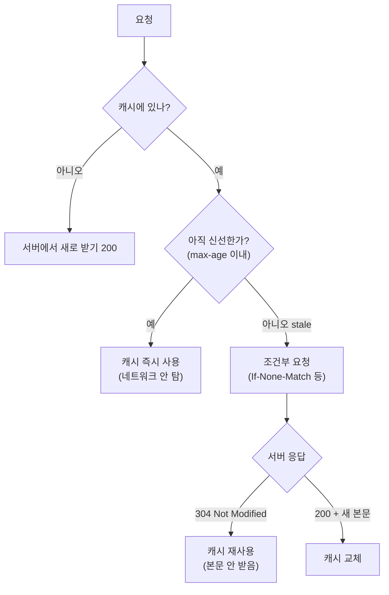

이전 글에서 Service Worker로 `stale-while-revalidate` 전략을 *직접* 구현했습니다. 캐시를 즉시 보여주고 뒤에서 조용히 갱신하는 코드를 손으로 짰습니다. 그런데 사실 브라우저에는 우리가 코드를 한 줄도 쓰지 않아도 동작하는 캐싱 계층이 이미 내장되어 있습니다. 그것을 제어하는 것이 **HTTP 캐시 헤더**입니다.

질문은 이렇습니다. **브라우저는 어떻게 "이 응답은 다시 받지 않고 캐시를 재사용해도 된다"고 판단하는가?** 그리고 캐시가 미심쩍을 때는 어떻게 "이거 아직 유효한가요?"라고 서버에 *효율적으로* 물어보는가?

이 질문의 답에 HTTP 캐싱의 두 가지 근본 메커니즘이 있습니다. **신선도(freshness)**와 **재검증(validation)**입니다. 이 둘의 구분을 명확히 잡는 것이 이 글의 핵심입니다.

## 두 개의 다른 질문: "물어봐도 되나?" vs "아직 유효한가?"

HTTP 캐싱은 사실 성격이 전혀 다른 두 메커니즘의 조합입니다.

**1. 신선도(freshness) — 서버에 *아예 묻지 않고* 캐시를 쓸 수 있는가?**
캐시된 응답에 "유효기간"이 붙어 있고, 그 기간이 지나지 않았다면 브라우저는 네트워크 요청 자체를 보내지 않습니다. 캐시에서 즉시 꺼내 씁니다. 가장 빠른 경로입니다.

**2. 재검증(validation) — 유효기간이 지난 캐시가, 그래도 *아직 쓸 만한가?***
유효기간이 지난(stale) 캐시는 곧장 버려지지 않습니다. 브라우저는 서버에 "내가 가진 이 버전, 아직 최신인가요?"라고 *조건부 요청*을 보냅니다. 서버가 "그대로다"라고 답하면(`304`), 본문 없이 캐시를 그대로 재사용합니다. 본문을 다시 받지 않으므로 대역폭을 아낍니다.

이 두 질문을 헷갈리지 않는 게 중요합니다. **신선도는 "네트워크를 건너뛸 수 있는가"의 문제**이고, **재검증은 "본문 전송을 건너뛸 수 있는가"의 문제**입니다.



## 신선도를 정하는 Cache-Control

신선도의 유효기간은 주로 응답 헤더 `Cache-Control`로 지정합니다.

```http
Cache-Control: max-age=3600
```

`max-age=3600`은 "이 응답은 받은 시점부터 3600초(1시간) 동안 신선하다"는 뜻입니다. 그 1시간 동안 같은 리소스를 다시 요청하면, 브라우저는 서버에 묻지도 않고 캐시에서 바로 꺼내 줍니다. (구형 `Expires` 헤더는 절대 시각으로 같은 일을 하지만, 클라이언트 시계에 의존하는 문제 때문에 상대 시간인 `max-age`가 선호됩니다.)

주요 디렉티브를 정리하면 이렇습니다.

| 디렉티브 | 의미 |
|---|---|
| `max-age=N` | N초 동안 신선함 (그동안 네트워크 안 탐) |
| `no-cache` | 저장은 하되, **쓰기 전에 항상 재검증**하라 |
| `no-store` | **저장 자체를 하지 말라** (민감 데이터) |
| `must-revalidate` | stale이 되면 반드시 재검증, 임의로 stale 응답 금지 |
| `private` | 브라우저만 캐싱, 공유 캐시(CDN)는 금지 |
| `public` | 공유 캐시도 캐싱 가능 |
| `s-maxage=N` | 공유 캐시 전용 max-age (브라우저용 max-age를 덮어씀) |
| `immutable` | 신선한 동안 절대 재검증하지 말라 (변하지 않는 자산) |

## 가장 흔한 오해: no-cache ≠ 캐싱 안 함

이름이 만든 함정이 하나 있습니다. **`no-cache`는 "캐싱하지 말라"가 아닙니다.** 정반대로, "캐싱은 하되 *쓰기 전에 반드시 서버에 재검증하라*"는 뜻입니다.

진짜로 저장을 막는 것은 `no-store`입니다. 셋의 차이를 분명히 해둡시다.

- **`no-store`** — 디스크에도 메모리에도 저장하지 말라. 매번 완전히 새로 받는다. 개인정보·결제 같은 민감 응답용.
- **`no-cache`** — 저장은 하되 신선도를 0으로 보고 매 요청마다 재검증한다. 본문이 안 바뀌었으면 `304`로 빠르게 끝난다.
- **`max-age=0, must-revalidate`** — `no-cache`와 사실상 같은 효과.

즉 `no-cache`는 "캐시를 끄는" 게 아니라 "캐시를 *항상 검증해서* 쓰는" 모드입니다. 신선도 단계를 건너뛰고 곧바로 재검증 단계로 가는 것입니다.

## 재검증의 도구: ETag와 Last-Modified

재검증을 하려면 서버와 클라이언트가 "내가 가진 버전"을 식별할 공통 표식이 필요합니다. 이 표식을 **검증자(validator)**라 하고, 두 종류가 있습니다.

**ETag** — 리소스 내용에 대한 일종의 지문(해시 등)입니다. 서버가 응답에 실어 보냅니다.

```http
# 첫 응답
HTTP/1.1 200 OK
ETag: "a1b2c3"
Cache-Control: max-age=60
```

캐시가 stale이 되면, 브라우저는 이 ETag를 `If-None-Match`에 담아 조건부 요청을 보냅니다.

```http
# 재검증 요청
GET /data HTTP/1.1
If-None-Match: "a1b2c3"
```

서버는 현재 리소스의 ETag와 비교합니다. 같으면 본문 없이 짧게 답합니다.

```http
# 안 바뀌었음
HTTP/1.1 304 Not Modified
ETag: "a1b2c3"
```

브라우저는 `304`를 받으면 캐시에 있던 본문을 그대로 쓰고, 신선도 타이머를 다시 시작합니다. **본문을 다시 전송하지 않으므로**, 큰 리소스일수록 절약 효과가 큽니다.

**Last-Modified** — 내용 대신 *마지막 수정 시각*을 검증자로 씁니다. 짝이 되는 요청 헤더는 `If-Modified-Since`입니다.

```http
Last-Modified: Wed, 11 Jun 2026 10:00:00 GMT
# → 재검증 시
If-Modified-Since: Wed, 11 Jun 2026 10:00:00 GMT
```

ETag가 Last-Modified보다 정밀합니다. Last-Modified는 초 단위 해상도라 1초 안에 두 번 바뀌면 변경을 놓칠 수 있고, 내용은 같은데 시각만 바뀌는 경우(예: 재배포)에도 불필요하게 새로 받게 만듭니다. ETag는 *내용*을 기준으로 하므로 이런 함정이 없습니다. 둘 다 있으면 ETag가 우선합니다.

## stale-while-revalidate: 헤더가 된 그 전략

이전 글에서 Service Worker로 손수 구현했던 `stale-while-revalidate`는, 사실 `Cache-Control`의 디렉티브로도 선언할 수 있습니다.

```http
Cache-Control: max-age=600, stale-while-revalidate=3600
```

이 헤더의 의미는 이렇습니다.

- 처음 600초: 신선함. 캐시 즉시 사용.
- 600초 ~ 3600초: stale이지만, **캐시를 즉시 돌려주면서 동시에 백그라운드에서 재검증**한다. 사용자는 기다리지 않고, 다음 요청은 갱신된 캐시를 받는다.
- 3600초 이후: 완전히 만료. 동기적으로 재검증해야 한다.

짝이 되는 `stale-if-error=N`도 있는데, "서버가 에러를 내면 그동안은 stale 캐시라도 보여줘라"는 회복탄력성 디렉티브입니다.

여기서 이 시리즈를 관통하는 패턴이 다시 드러납니다. **"오래된 것을 일단 보여주고 뒤에서 갱신한다"**는 발상이 세 계층에 똑같이 나타나는 것입니다.

- **TanStack Query** — `staleTime`으로 앱 레벨에서 (첫 글)
- **Service Worker** — `fetch` 핸들러에서 손수 구현 (이전 글)
- **HTTP 캐시** — `Cache-Control: stale-while-revalidate`로 선언적으로 (이 글)

같은 캐싱 철학이 추상화 계층만 바꿔가며 반복됩니다. 한 계층에서 이해하면 나머지가 전부 익숙해지는 이유입니다.

## 공유 캐시와 Vary: CDN을 위한 고려

지금까지는 브라우저 캐시를 가정했지만, 요청 경로에는 CDN·프록시 같은 **공유 캐시(shared cache)**도 있습니다. 여러 사용자가 한 캐시를 공유하므로 추가 고려가 필요합니다.

- **`private`** — 사용자별 응답(로그인 사용자 정보 등). 공유 캐시는 저장하면 안 된다.
- **`public` / `s-maxage`** — 공유 캐시도 캐싱 가능하며, `s-maxage`로 공유 캐시 전용 수명을 따로 줄 수 있다.

그리고 `Vary` 헤더가 중요합니다. 같은 URL이라도 요청 헤더에 따라 응답이 달라질 수 있는데, 캐시는 기본적으로 URL만 키로 봅니다. `Vary`는 "이 응답은 이 요청 헤더 값에 따라 달라진다"고 캐시에 알립니다.

```http
Vary: Accept-Encoding, Accept-Language
```

이러면 캐시는 URL + `Accept-Encoding` + `Accept-Language` 조합별로 응답을 따로 저장합니다. `Vary`를 빠뜨리면, gzip 응답을 압축 미지원 클라이언트에게 주는 식의 캐시 오염이 발생할 수 있습니다.

## 실전 패턴: 무엇에 무엇을 붙이나

이론을 실제 배포 전략으로 옮기면 대략 이렇게 정리됩니다.

**해시된 정적 자산** (`app.a1b2c3.js`처럼 내용 기반 파일명) — 내용이 바뀌면 파일명이 바뀌므로, 같은 URL은 영원히 같은 내용입니다. 공격적으로 캐싱합니다.

```http
Cache-Control: public, max-age=31536000, immutable
```

**HTML 문서** — 새 배포를 즉시 반영해야 하므로, 항상 재검증합니다.

```http
Cache-Control: no-cache
```

`no-cache` + ETag 조합이면, 안 바뀐 HTML은 `304`로 가볍게 끝나고 새 배포는 즉시 반영됩니다. "캐시 영원히(자산) + 항상 검증(HTML)" 조합이 현대 프론트엔드 배포의 표준 패턴입니다.

**API 응답** — 신선도와 회복탄력성을 절충합니다.

```http
Cache-Control: private, max-age=60, stale-while-revalidate=600
```

## 정리: 코드 없이 동작하는 캐싱 계층

Service Worker에서 우리는 캐싱을 *명령형으로* 짰습니다. HTTP 캐싱은 같은 일을 **선언적으로**, 그것도 브라우저가 우리 대신 자동으로 수행하게 합니다.

- **신선도 vs 재검증** — "네트워크를 건너뛰는가"(max-age)와 "본문 전송을 건너뛰는가"(304)는 다른 메커니즘이다.
- **`no-cache` ≠ 캐싱 안 함** — 저장하되 항상 재검증. 진짜 차단은 `no-store`.
- **ETag/Last-Modified** — 조건부 요청의 검증자. ETag가 내용 기반이라 더 정밀하다.
- **`stale-while-revalidate`** — 손으로 짰던 그 전략이 헤더 한 줄로. 같은 캐싱 철학이 앱·SW·HTTP 세 계층에 반복된다.
- **공유 캐시·`Vary`** — CDN을 고려하면 `private`/`s-maxage`/`Vary`가 추가로 필요하다.

다음에 네트워크 탭에서 `304`나 `(from disk cache)`를 보게 된다면, 그것이 우연이 아니라 **신선도와 재검증이라는 두 메커니즘이 헤더의 지시대로 작동한 결과**임을 떠올려 보시기 바랍니다. 그리고 그 판단 기준을 정하는 것은 결국 서버가 응답에 실어 보내는 `Cache-Control` 한 줄입니다 — 캐싱의 통제권은 클라이언트가 아니라 서버의 손에 있습니다.
