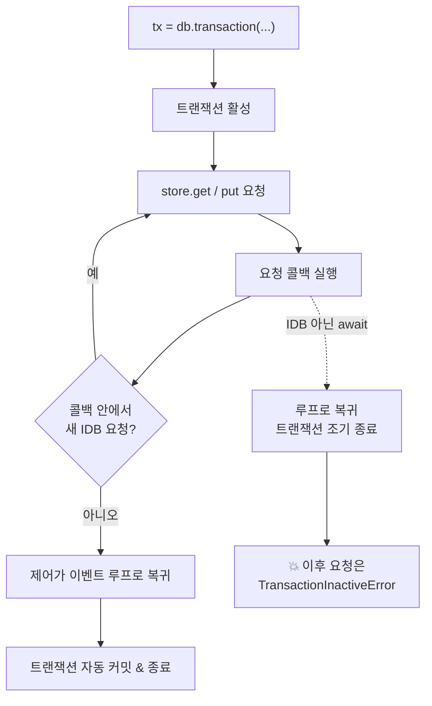

브라우저에 데이터를 저장한다고 하면 대부분 `localStorage`를 떠올립니다. `localStorage.setItem('key', value)` — 간단하고 직관적입니다. 그런데 이 간단함 뒤에는 세 가지 치명적인 제약이 숨어 있습니다.

- **동기적이다.** `localStorage`에 대한 모든 읽기·쓰기는 메인 스레드를 *차단*합니다. 큰 데이터를 다루면 UI가 그대로 멈춥니다.
- **문자열만 저장한다.** 객체를 넣으려면 매번 `JSON.stringify`/`parse`를 거쳐야 하고, 그 과정에서 타입 정보와 참조가 망가집니다.
- **용량이 작다.** 보통 출처(origin)당 5MB 안팎입니다.

이 제약들은 "설정값 몇 개" 수준을 넘어서는 순간 곧바로 벽이 됩니다. 오프라인 캐시, 대용량 파일, 구조화된 레코드 수천 건 — 이런 것을 다루려면 다른 도구가 필요합니다. 그 도구가 바로 **IndexedDB**, 브라우저에 내장된 *트랜잭션 기반 객체 데이터베이스*입니다.

IndexedDB는 악명 높게 다루기 까다로운 API로 알려져 있습니다. 하지만 그 까다로움의 대부분은 **비동기 모델**과 **트랜잭션 생명주기**라는 두 가지 핵심 개념에서 나옵니다. 이 글은 그 두 가지를 중심으로 IndexedDB가 *왜* 그렇게 동작하는지를 파고듭니다.

## localStorage와 무엇이 근본적으로 다른가

먼저 큰 그림에서 둘을 대조해 봅시다.

| | localStorage | IndexedDB |
|---|---|---|
| 실행 모델 | 동기 (메인 스레드 차단) | 비동기 (이벤트 기반) |
| 저장 형태 | 문자열만 | 구조화된 객체 (structured clone) |
| 용량 | 출처당 ~5MB | 디스크 여유의 상당 비율 (수백 MB~GB) |
| 트랜잭션 | 없음 | ACID 트랜잭션 |
| 조회 | 키로만 | 인덱스 + 범위 쿼리 + 커서 |
| Web Worker | 접근 불가 | 접근 가능 |

핵심은 IndexedDB가 단순한 키-값 저장소가 아니라 **인덱스와 트랜잭션을 갖춘 진짜 데이터베이스**라는 점입니다. 그리고 모든 연산이 비동기라 메인 스레드를 막지 않으며, Web Worker에서도 쓸 수 있습니다.

## 객체 모델: 데이터베이스 → 객체 저장소 → 레코드

IndexedDB의 구조는 세 계층입니다.

```
Database (이름 + 버전)
  └─ Object Store (테이블에 해당)
       └─ Record (키 + 값. 값은 임의의 구조화 객체)
```

**객체 저장소(object store)**가 관계형 DB의 테이블에 해당합니다. 단, 스키마가 고정되어 있지 않아 임의의 자바스크립트 객체를 그대로 넣을 수 있습니다. 각 레코드는 키로 식별되는데, 키를 정하는 방식이 두 가지입니다.

```javascript
// 1. in-line key: 값 객체 안의 특정 속성을 키로 사용 (keyPath)
db.createObjectStore('users', { keyPath: 'id' });
// → { id: 1, name: 'Kim' } 을 넣으면 키는 1

// 2. autoIncrement: 자동 증가 키
db.createObjectStore('logs', { keyPath: 'id', autoIncrement: true });

// 3. out-of-line key: 키를 따로 넘김
db.createObjectStore('files');
store.put(blob, 'avatar.png'); // 값과 키를 분리해서 전달
```

## 버전과 스키마: onupgradeneeded라는 유일한 창구

IndexedDB에서 객체 저장소나 인덱스를 만들고 바꾸는 일은 **오직 한 곳에서만** 가능합니다. 데이터베이스를 열 때 발생하는 `upgradeneeded` 이벤트 안입니다.

```javascript
const request = indexedDB.open('myApp', 2); // 이름, 버전

request.onupgradeneeded = (event) => {
  const db = event.target.result;
  const oldVersion = event.oldVersion;

  // 스키마 변경은 여기서만 가능
  if (oldVersion < 1) {
    const users = db.createObjectStore('users', { keyPath: 'id' });
    users.createIndex('byEmail', 'email', { unique: true });
  }
  if (oldVersion < 2) {
    // 버전 2로 올리며 추가된 스키마
    db.createObjectStore('sessions', { keyPath: 'token' });
  }
};

request.onsuccess = (event) => {
  const db = event.target.result; // 이제 db를 쓸 수 있다
};
```

버전 번호를 올려 `open`을 호출하면 `upgradeneeded`가 발생하고, 그 안에서 마이그레이션을 수행합니다. `oldVersion`을 보고 단계별로 스키마를 누적 적용하는 패턴이 정석입니다. 마치 DB 마이그레이션 파일을 버전순으로 실행하는 것과 같습니다. 이 단계는 특별한 `versionchange` 트랜잭션 안에서 실행되며, 스키마를 바꿀 수 있는 유일한 시점입니다.

## 트랜잭션: IndexedDB의 심장

여기서부터가 IndexedDB의 본질이자, 사람들이 가장 많이 걸려 넘어지는 지점입니다. **IndexedDB의 모든 읽기·쓰기는 반드시 트랜잭션 안에서 일어납니다.**

```javascript
// 트랜잭션 생성: 대상 저장소들, 모드
const tx = db.transaction(['users'], 'readwrite');
const store = tx.objectStore('users');

store.put({ id: 1, name: 'Kim', email: 'kim@example.com' });
store.put({ id: 2, name: 'Lee', email: 'lee@example.com' });

tx.oncomplete = () => console.log('두 쓰기가 원자적으로 커밋됨');
tx.onerror = () => console.log('하나라도 실패하면 전체 롤백');
```

모드는 세 가지입니다. `readonly`(동시 다발 가능), `readwrite`(쓰기 잠금), 그리고 앞서 본 `versionchange`(스키마 변경 전용)입니다. 트랜잭션은 ACID를 보장합니다 — 트랜잭션 안의 여러 연산은 전부 성공하거나 전부 롤백됩니다.

## 비동기 모델: request와 이벤트

IndexedDB의 개별 연산(`put`, `get`, `delete` 등)은 즉시 값을 반환하지 않습니다. 대신 **`IDBRequest` 객체**를 반환하고, 결과는 이벤트로 전달됩니다.

```javascript
const tx = db.transaction(['users'], 'readonly');
const store = tx.objectStore('users');

const request = store.get(1); // 즉시 IDBRequest 반환

request.onsuccess = (event) => {
  const user = event.target.result; // 여기서 결과 도착
  console.log(user);
};
request.onerror = (event) => {
  console.error(event.target.error);
};
```

이 콜백/이벤트 기반 API가 IndexedDB를 투박하게 만드는 표면적 원인입니다. 그래서 실무에서는 거의 대부분 이걸 프로미스로 감싸 씁니다. 다만 *그냥 감싸면 안 되는* 함정이 있는데, 바로 다음 절의 트랜잭션 생명주기 때문입니다.

## 가장 큰 함정: 트랜잭션은 스스로 닫힌다

IndexedDB 트랜잭션은 명시적으로 commit을 호출하지 않습니다. **트랜잭션은 처리할 요청이 더 이상 없으면 *자동으로* 커밋됩니다.** 그런데 "더 이상 없다"를 판단하는 기준이 이벤트 루프와 얽혀 있어, 여기서 미묘한 버그가 발생합니다.

규칙을 정확히 말하면 이렇습니다. 트랜잭션은 생성된 시점에 "활성(active)" 상태가 되고, **현재 작업(task)과 그에 딸린 요청 콜백들이 이어지는 동안에만** 활성을 유지합니다. 활성 상태에서 마지막 요청의 콜백이 끝났는데 그 안에서 새 요청을 걸지 않으면, 제어가 이벤트 루프로 돌아가는 순간 트랜잭션은 비활성화되고 자동 커밋됩니다.

문제는 이 메커니즘이 **마이크로태스크 타이밍과 충돌**한다는 데 있습니다. 트랜잭션 도중에 IndexedDB와 무관한 프로미스를 `await` 하면 어떻게 될까요?

```javascript
const tx = db.transaction(['users'], 'readwrite');
const store = tx.objectStore('users');

await store.get(1);          // (가정상 프로미스로 감쌌다고 치자)
await fetch('/api/whatever'); // ← IndexedDB와 무관한 비동기 작업!
store.put({ id: 1, ... });   // 💥 TransactionInactiveError
```

`fetch`를 기다리는 사이 제어권이 이벤트 루프로 넘어가고, 그동안 트랜잭션은 "할 일이 없네"라고 판단해 커밋되고 닫혀버립니다. 그 뒤에 `store.put`을 호출하면 이미 죽은 트랜잭션이라 `TransactionInactiveError`가 터집니다.

이전에 다룬 이벤트 루프 지식이 여기서 빛을 발합니다. IndexedDB 트랜잭션의 수명은 본질적으로 **"하나의 task 턴, 그리고 그 안에서 연쇄되는 요청 콜백들"**에 묶여 있습니다. 그 연쇄가 끊겨 제어가 루프로 돌아가면 트랜잭션은 닫힙니다. 그래서 철칙이 하나 도출됩니다.

> **하나의 트랜잭션 안에서는, IndexedDB 요청이 아닌 다른 비동기 작업을 기다리지 말라.**

`fetch`로 데이터를 받아야 한다면 *트랜잭션 밖에서* 먼저 받고, 그 결과를 들고 트랜잭션을 열어 한 호흡에 써야 합니다. `idb`나 `Dexie` 같은 래퍼 라이브러리가 단순히 프로미스 변환만 하는 게 아니라, 바로 이 트랜잭션 생명주기를 안전하게 관리해주기 때문에 가치가 있는 것입니다.



## 인덱스와 커서: 진짜 쿼리

IndexedDB가 단순 키-값 저장소를 넘어서는 지점이 인덱스입니다. 키가 아닌 다른 속성으로도 조회할 수 있게 해줍니다.

```javascript
// upgradeneeded 안에서 인덱스 생성
const store = db.createObjectStore('users', { keyPath: 'id' });
store.createIndex('byEmail', 'email', { unique: true });
store.createIndex('byAge', 'age'); // 중복 허용

// 인덱스로 조회
const tx = db.transaction(['users'], 'readonly');
const index = tx.objectStore('users').index('byEmail');
const req = index.get('kim@example.com'); // 이메일로 조회
```

범위 쿼리는 `IDBKeyRange`로 표현합니다.

```javascript
// 18세 이상 30세 미만
const range = IDBKeyRange.bound(18, 30, false, true);
const index = store.index('byAge');

// 커서로 순회 (한 건씩 스트리밍)
index.openCursor(range).onsuccess = (event) => {
  const cursor = event.target.result;
  if (cursor) {
    console.log(cursor.value); // 현재 레코드
    cursor.continue();          // 다음으로 — 또 onsuccess 발생
  } else {
    console.log('순회 끝');
  }
};
```

커서는 한 번에 모든 결과를 메모리에 올리지 않고 **한 건씩 스트리밍**하므로, 수만 건을 다룰 때도 메모리 부담이 적습니다. `cursor.continue()`를 부를 때마다 같은 `onsuccess`가 다시 호출되는 재귀적 패턴인데, 이 호출 자체가 "트랜잭션 안의 새 요청"이라 트랜잭션을 계속 활성 상태로 유지시킨다는 점도 앞 절과 연결됩니다.

## structured clone: 무엇을 저장할 수 있나

IndexedDB가 값을 저장하는 방식은 `JSON.stringify`가 아니라 **structured clone 알고리즘**입니다. 이것이 `localStorage`와의 큰 차이를 만듭니다.

저장 *가능*한 것: 일반 객체와 배열, `Date`, `RegExp`, `Map`, `Set`, `ArrayBuffer`와 타입 배열, `Blob`/`File`, 그리고 **순환 참조**까지. JSON으로는 불가능한 것들이 자연스럽게 저장됩니다.

저장 *불가능*한 것: 함수, DOM 노드, 프로토타입 체인(클래스 인스턴스는 평범한 객체로 납작해집니다), 그리고 클로저가 잡고 있는 상태.

```javascript
const store = tx.objectStore('files');
store.put(new Blob([buffer], { type: 'image/png' }), 'avatar'); // ✅ Blob 그대로 저장
store.put(new Map([['a', 1]]), 'config'); // ✅ Map도 OK
store.put(() => {}, 'fn'); // ❌ DataCloneError
```

이 덕분에 이미지·동영상 같은 바이너리를 base64 문자열로 부풀리지 않고 `Blob`째로 효율적으로 저장할 수 있습니다. 오프라인 미디어 캐시를 IndexedDB로 구현하는 이유입니다.

## 영속성과 용량: 데이터는 언제 사라지나

마지막으로, IndexedDB에 저장한 데이터가 *영원하지 않을 수 있다*는 점을 짚어야 합니다. 브라우저는 기본적으로 IndexedDB를 **"best-effort"** 저장소로 취급합니다. 디스크 공간이 부족하면 오래된 출처의 데이터를 임의로 비울(evict) 수 있습니다.

데이터를 반드시 유지하려면 영속성을 명시적으로 요청해야 합니다.

```javascript
// 영속 저장 권한 요청
const persisted = await navigator.storage.persist();
console.log('영속 모드:', persisted);

// 할당량과 사용량 확인
const { usage, quota } = await navigator.storage.estimate();
console.log(`${usage} / ${quota} 바이트 사용 중`);
```

`persist()`가 승인되면(보통 사용자 참여도가 높은 사이트에 한해) 브라우저는 사용자가 명시적으로 지우기 전까지 데이터를 보존합니다. 용량 역시 `localStorage`의 고정 5MB와 달리, 디스크 여유 공간의 상당 비율까지 동적으로 허용됩니다.

## 정리: 투박함 뒤의 일관된 설계

IndexedDB의 API는 분명 투박합니다. 콜백과 이벤트, 자동으로 닫히는 트랜잭션, `upgradeneeded`라는 좁은 스키마 변경 창구. 하지만 이 투박함의 대부분은 **메인 스레드를 막지 않으면서 ACID 트랜잭션을 제공한다**는 어려운 목표에서 비롯된 필연적 결과입니다.

- **비동기 + 이벤트 모델** — UI를 멈추지 않기 위한 대가. 그래서 프로미스 래퍼가 사실상 필수다.
- **자동 커밋 트랜잭션** — 수명이 이벤트 루프의 task 턴에 묶여 있어, 트랜잭션 안에서 무관한 `await`를 하면 조기에 닫힌다. IndexedDB를 다룰 때 가장 먼저 내면화해야 할 규칙이다.
- **인덱스 + 커서** — 키-값을 넘어선 진짜 쿼리. 커서는 대용량을 스트리밍으로 다룬다.
- **structured clone** — 문자열이 아니라 구조화 객체를 저장하므로 `Blob`, `Map`, 순환 참조까지 담는다.

`localStorage`가 "작은 설정값을 위한 동기적 메모"라면, IndexedDB는 "오프라인 애플리케이션을 떠받치는 클라이언트 측 데이터베이스"입니다. 다음에 브라우저에 무언가를 *제대로* 저장해야 하는 순간이 온다면, 그 까다로움이 사실은 동기 차단 없이 트랜잭션을 보장하기 위한 정교한 설계의 흔적임을 떠올려 보시기 바랍니다.
