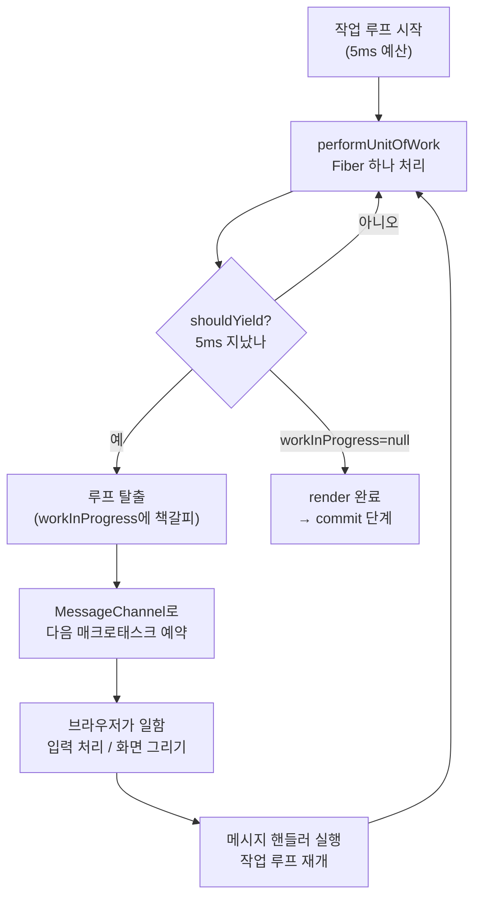

이전 글에서 tearing을 설명하며 React 18의 렌더링이 "잘게 쪼개져 중단되고 재개될 수 있다(time slicing)"는 사실을 *전제*로 깔았습니다. 양보하는 틈에 외부 스토어가 바뀌어 화면이 찢어진다는 시나리오였습니다. 그런데 거기서 답하지 않은 근본적인 질문이 하나 있습니다.

**도대체 React는 컴포넌트 트리를 그리다 말고 어떻게 *중간에 멈췄다가*, 나중에 정확히 *그 지점부터* 다시 이어 그릴 수 있는가?**

함수형 컴포넌트를 떠올려 보면 이건 마법처럼 들립니다. 컴포넌트 트리를 그린다는 건 결국 부모가 자식을 호출하고, 그 자식이 또 자식을 호출하는 **재귀**입니다. 그런데 재귀는 멈출 수가 없습니다. 한번 함수를 호출하면 그 함수가 끝날 때까지 콜스택에서 돌아오지 않습니다. 멈추고 싶어도 멈출 방법이 없는 것입니다.

이 글은 그 마법의 정체를 다룹니다. 답의 핵심에 **Fiber**라는 자료구조와 **스케줄러**가 있습니다. 그리고 "어떻게 양보하는가"는 이미 [MessageChannel 글](#)에서 다뤘으니, 이번 글은 "무엇을 쪼개고, 어디서 멈추고, 어떻게 재개하는가"에 집중합니다.

## 문제의 뿌리: 재귀는 멈출 수 없다

React 15까지의 재조정(reconciliation)은 **스택 재조정기(Stack Reconciler)**라 불렸습니다. 이름 그대로 자바스크립트의 콜스택에 의존해 트리를 재귀적으로 순회했습니다.

```typescript
// 개념적으로 이런 모양이었다
function reconcile(element) {
  const children = renderComponent(element);
  for (const child of children) {
    reconcile(child); // 재귀 호출
  }
}
```

이 방식의 치명적 한계가 바로 동시성을 불가능하게 만들었습니다. `reconcile`이 한번 시작되면 트리 전체를 다 그릴 때까지 콜스택에서 빠져나오지 않습니다. 그 사이 브라우저는 아무것도 못 합니다 — 사용자 입력도, 애니메이션도, 화면 갱신도 전부 막힙니다. 트리가 크면 "버벅임(jank)"이 생기는 이유입니다.

멈추려면 어떻게 해야 할까요? **순회 상태를 콜스택이 아니라, React가 직접 통제하는 자료구조에 담아야 합니다.** 콜스택은 우리가 마음대로 멈추거나 저장할 수 없지만, 우리가 만든 자료구조라면 "지금 어디까지 했는지"를 변수에 저장해 두고 언제든 멈췄다 이어갈 수 있습니다. 이 깨달음이 React 16의 **Fiber 재조정기**를 낳았습니다.

## Fiber: 작업 단위이자 연결 리스트의 노드

Fiber는 두 가지 정체성을 동시에 가집니다. 하나는 **컴포넌트 인스턴스에 대응하는 작업 단위(unit of work)**이고, 다른 하나는 **트리를 연결 리스트로 표현하기 위한 노드**입니다.

각 Fiber 노드는 대략 이런 필드를 가집니다.

```typescript
type Fiber = {
  type: any;          // 컴포넌트 함수, 또는 'div' 같은 호스트 타입
  key: null | string;

  // --- 트리 구조를 표현하는 세 개의 포인터 ---
  child: Fiber | null;   // 첫 번째 자식
  sibling: Fiber | null; // 다음 형제
  return: Fiber | null;  // 부모 (작업 완료 후 "돌아갈" 곳)

  // --- 상태와 변경 정보 ---
  pendingProps: any;   // 이번에 처리할 새 props
  memoizedProps: any;  // 직전에 렌더된 props
  memoizedState: any;  // 훅 체인이 여기 매달린다
  flags: number;       // 이 노드에 필요한 DOM 작업(삽입/수정/삭제) 표시

  alternate: Fiber | null; // 더블 버퍼링용 반대편 트리의 짝
  lanes: number;           // 이 작업의 우선순위
};
```

여기서 결정적인 건 `child`, `sibling`, `return` 세 포인터입니다. 이 포인터들이 트리를 **연결 리스트처럼 순회 가능한 구조**로 만듭니다. 재귀 대신, 이 포인터를 따라가는 반복(iteration)으로 트리를 훑을 수 있게 된 것입니다.

```
        App
         │ child
         ▼
       Header ──sibling──▶ Content ──sibling──▶ Footer
                              │ child
                              ▼
                            List
```

순회 규칙은 단순합니다. **자식이 있으면 자식으로 내려가고(`child`), 자식이 없으면 형제로 넘어가고(`sibling`), 형제도 없으면 부모로 돌아간다(`return`).** 이렇게 하면 재귀 없이 깊이 우선으로 트리 전체를 방문할 수 있습니다. 그리고 결정적으로, **언제든 "다음에 처리할 Fiber"를 변수 하나에 저장해두면 거기서 멈췄다가 이어갈 수 있습니다.** 그 변수가 바로 `workInProgress`입니다.

## 작업 루프: 한 번에 Fiber 하나씩

이제 멈출 수 있는 렌더링의 심장, 작업 루프(work loop)를 봅시다. 동시성 모드의 작업 루프는 놀라울 만큼 간결합니다.

```typescript
let workInProgress: Fiber | null = null; // 다음에 처리할 Fiber

function workLoopConcurrent() {
  // Fiber가 남아있고, "아직 양보할 때가 아니라면" 계속 처리
  while (workInProgress !== null && !shouldYield()) {
    performUnitOfWork(workInProgress);
  }
}
```

이 `while` 루프가 핵심 전부입니다. `performUnitOfWork`는 Fiber **하나**를 처리하고 `workInProgress`를 다음 Fiber로 옮깁니다. 그리고 매 반복마다 `shouldYield()`를 확인합니다.

```typescript
function performUnitOfWork(fiber: Fiber) {
  // 1. 이 Fiber에 대해 작업 수행 (컴포넌트 호출, 자식 생성)
  const next = beginWork(fiber);

  if (next === null) {
    // 자식이 없으면 이 Fiber를 "완료"하고 형제/부모로 이동
    completeUnitOfWork(fiber);
  } else {
    // 자식이 있으면 자식을 다음 작업 대상으로
    workInProgress = next;
  }
}
```

비교해 봅시다. 스택 재조정기는 트리 전체를 하나의 거대한 재귀로 처리해서 중간에 멈출 수 없었습니다. Fiber의 작업 루프는 트리를 **Fiber 하나 단위로 잘게 쪼개** 처리하고, **매 단위 사이에 멈출 기회**를 줍니다. 동일한 깊이 우선 순회지만, 콜스택의 재귀를 `workInProgress` 포인터를 따라가는 반복으로 바꿨기 때문에 중단이 가능해진 것입니다.

## shouldYield: 5ms라는 시간 예산

그렇다면 "양보할 때"는 언제일까요? `shouldYield`의 판단 기준은 의외로 소박합니다 — **시간**입니다.

```typescript
let startTime = -1;
const frameInterval = 5; // 5ms

function shouldYield() {
  const timeElapsed = now() - startTime;
  if (timeElapsed < frameInterval) {
    return false; // 아직 시간 예산이 남았다, 계속 일해라
  }
  return true; // 5ms를 다 썼다, 브라우저에 양보해라
}
```

React는 작업을 시작할 때마다 약 **5ms의 시간 예산(time slice)**을 받습니다. Fiber를 하나씩 처리하다가 이 5ms를 초과하면 `shouldYield`가 `true`를 반환하고, 작업 루프의 `while` 조건이 깨지면서 루프가 *빠져나옵니다*. 이때 `workInProgress`에는 "다음에 처리할 Fiber"가 그대로 저장되어 있습니다. 멈춘 게 아니라 **잠시 책갈피를 꽂아둔 것**입니다.

왜 하필 5ms일까요? 브라우저가 60fps를 유지하려면 한 프레임이 약 16.6ms 안에 끝나야 합니다. React가 한 호흡에 5ms만 쓰고 양보하면, 나머지 시간 동안 브라우저는 사용자 입력에 반응하고 화면을 그릴 수 있습니다. **렌더링을 잘게 쪼개 메인 스레드를 독점하지 않는 것** — 이것이 time slicing의 본질입니다.

## 양보와 재개: 스케줄러와 MessageChannel

작업 루프가 양보하며 빠져나온 뒤, 남은 작업은 어떻게 다시 이어질까요? 여기서 **스케줄러(scheduler)**가 등장합니다. 스케줄러는 "아직 끝나지 않았다면, 브라우저에 제어권을 돌려준 뒤 *다음 기회에* 작업 루프를 다시 부른다"는 일을 합니다.

```typescript
function performConcurrentWorkOnRoot(root) {
  workLoopConcurrent(); // 5ms 동안 일하다 양보하고 빠져나옴

  if (workInProgress !== null) {
    // 아직 처리할 Fiber가 남았다 → 계속할 작업을 다시 예약
    return performConcurrentWorkOnRoot.bind(null, root);
  }
  // 다 끝났으면 커밋 단계로
  commitRoot(root);
}
```

그런데 "다음 기회에 다시 부른다"를 어떻게 구현할까요? 바로 이 지점이 [MessageChannel 글](#)과 정확히 맞물립니다. 스케줄러는 남은 작업을 **매크로태스크(macrotask)**로 예약합니다. 마이크로태스크로 예약하면 브라우저가 화면을 그리거나 이벤트를 처리할 틈 없이 곧바로 실행되어 양보의 의미가 없어지고, `setTimeout(fn, 0)`은 5회 이후 4ms 지연이 강제되는 문제가 있습니다. 그래서 스케줄러는 `MessageChannel`을 써서 지연 없이 매크로태스크 큐에 작업을 등록합니다.

```typescript
const channel = new MessageChannel();
channel.port1.onmessage = performWorkUntilDeadline; // 작업 루프 재개
function schedulePerformWorkUntilDeadline() {
  channel.port2.postMessage(null); // 다음 매크로태스크로 예약
}
```

전체 흐름을 그리면 이렇습니다.



## 두 개의 단계: render는 멈출 수 있고, commit은 멈출 수 없다

여기서 반드시 짚어야 할 구분이 있습니다. React의 갱신은 **render 단계**와 **commit 단계**로 나뉘며, 둘의 성질이 정반대입니다.

**render 단계(reconciliation)** — 지금까지 본 작업 루프가 도는 곳입니다. 컴포넌트를 호출해 어떤 변경이 필요한지 계산하고, `flags`로 표시해 둡니다. **이 단계는 중단·재개·심지어 폐기가 가능합니다.** 그래서 절대 실제 DOM을 건드리지 않고, 부수 효과(side effect)도 일으키지 않습니다. 중간에 버려질 수 있는 작업이 부수 효과를 내면 재앙이기 때문입니다. (React 개발 모드에서 컴포넌트를 두 번 호출해 순수성을 검사하는 이유가 여기 있습니다.)

**commit 단계** — render 단계가 계산해 둔 변경 사항을 실제 DOM에 적용하는 곳입니다. **이 단계는 동기적이고 중단 불가능합니다.** 한 호흡에 끝나야 합니다. 만약 DOM을 절반만 갱신하고 양보한다면, 사용자는 일관성이 깨진 화면을 보게 될 테니까요.

```
render 단계  ████░░████░░████   ← 중단/재개/폐기 가능 (순수해야 함)
                              │
commit 단계                   ▼████  ← 원자적, 중단 불가
```

이 구분이 지난 글의 tearing과 직접 연결됩니다. tearing이 발생하는 "양보하는 틈"이 바로 **render 단계의 Fiber 처리 사이**입니다. 외부 스토어는 commit이 아니라 render 단계 도중에 바뀔 수 있고, 그래서 `useSyncExternalStore`가 필요했던 것입니다.

## 더블 버퍼링: 버릴 수 있는 트리

render 단계가 "폐기 가능"하다고 했는데, 어떻게 절반쯤 그린 결과를 안전하게 버릴 수 있을까요? **더블 버퍼링(double buffering)** 덕분입니다.

React는 항상 두 개의 Fiber 트리를 유지합니다.

- **current 트리** — 지금 화면에 그려져 있는 트리
- **workInProgress 트리** — 다음 화면을 위해 *백그라운드에서* 만들고 있는 트리

두 트리의 짝이 되는 노드는 서로 `alternate` 포인터로 연결됩니다. React는 화면에 보이는 current 트리는 그대로 둔 채, workInProgress 트리를 화면 밖에서 조립합니다. 이 작업이 중단되어도, 더 급한 업데이트가 끼어들어도 상관없습니다. workInProgress 트리는 아직 화면에 없으니 **그냥 버리고 처음부터 다시 만들면** 됩니다. 사용자는 중간 과정을 결코 보지 못합니다.

render 단계가 완전히 끝나면, commit 단계에서 두 트리의 역할을 **맞바꿉니다(swap)**. 방금까지 workInProgress였던 트리가 새로운 current가 되는 것입니다. 게임 그래픽스의 더블 버퍼링과 똑같은 발상입니다 — 다음 프레임을 뒷버퍼에 다 그린 다음 한 번에 화면과 교체해, 깜빡임이나 찢어짐을 없애는 기법 말입니다.

## Lane: 우선순위라는 마지막 조각

마지막으로, 모든 업데이트가 평등하지 않다는 점을 짚고 넘어가겠습니다. 사용자의 키 입력은 즉시 반영되어야 하지만, 무거운 검색 결과 리스트 갱신은 조금 늦어도 괜찮습니다. React는 이 우선순위를 **lane**이라는 비트마스크로 표현합니다.

```typescript
const SyncLane           = 0b0000000000000000000000000000001; // 최우선 (동기)
const InputContinuousLane = 0b0000000000000000000000000000100;
const DefaultLane        = 0b0000000000000000000000000010000;
const TransitionLane     = 0b0000000000000000000000001000000; // 낮은 우선순위
```

각 Fiber와 업데이트에는 lane이 붙습니다. 스케줄러는 더 높은 우선순위의 lane이 들어오면, 진행 중이던 낮은 우선순위 작업을 **중단하고 그 트리를 폐기한 뒤**, 급한 작업을 먼저 처리합니다. 앞서 본 더블 버퍼링이 바로 이 "중단하고 폐기"를 가능하게 하는 토대입니다.

이것으로 지난 두 글의 퍼즐 조각이 맞춰집니다.

- `startTransition`으로 감싼 업데이트는 `TransitionLane`이라는 낮은 우선순위를 받아, 급한 입력에 의해 언제든 중단·재시작될 수 있습니다.
- `useSyncExternalStore`가 스토어 업데이트를 "동기적으로" 처리한다고 했던 것은, 그 업데이트를 `SyncLane`으로 올려 time slicing에서 빼낸다는 뜻입니다. 중단될 수 없으니 tearing도 없습니다.

## 정리: 멈출 수 있는 렌더링의 구조

처음의 질문 — "어떻게 트리를 그리다 말고 멈췄다 이어 그리는가" — 에 이제 답할 수 있습니다.

> React는 콜스택 재귀로 트리를 그리던 방식을 버리고, 트리를 **Fiber 노드의 연결 리스트**로 표현했다. **작업 루프**는 이 리스트를 Fiber 하나 단위로 순회하며, 매 단위 사이에 **`shouldYield`로 5ms 시간 예산**을 확인한다. 예산을 다 쓰면 `workInProgress`에 책갈피를 꽂고 루프를 빠져나와, **MessageChannel 매크로태스크**로 나머지 작업을 예약한 뒤 브라우저에 양보한다. 이 모든 중단·재개·폐기는 화면에 보이지 않는 **workInProgress 트리(더블 버퍼링)** 위에서 일어나며, **render 단계**가 완전히 끝나야 비로소 중단 불가능한 **commit 단계**가 한 호흡에 DOM에 반영한다. 그리고 무엇을 먼저 처리할지는 **lane** 우선순위가 결정한다.

Fiber는 흔히 "성능 최적화"로 소개되지만, 더 정확히 말하면 **렌더링을 중단 가능하게 만들기 위한 자료구조의 재설계**입니다. 재귀를 반복으로 바꾸고, 콜스택을 직접 통제하는 연결 리스트로 옮긴 그 한 번의 결정이 time slicing, `startTransition`, Suspense, 그리고 — 우리가 세 편에 걸쳐 따라온 — tearing 문제와 그 해법까지, React 18 동시성의 모든 것을 떠받치고 있습니다.
