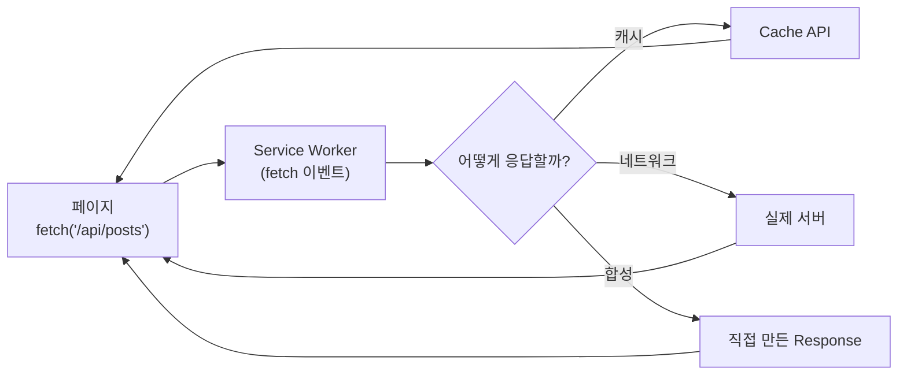
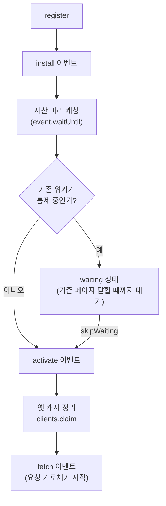

이전 글에서 IndexedDB를 "오프라인 애플리케이션을 떠받치는 클라이언트 측 데이터베이스"라고 불렀습니다. 그런데 데이터를 저장하는 것만으로는 오프라인 웹이 완성되지 않습니다. 결정적인 조각이 하나 빠져 있습니다.

**네트워크가 끊긴 상태에서, 브라우저가 `index.html`과 `app.js`조차 가져올 수 없다면 어떻게 페이지를 띄울 것인가?**

데이터(IndexedDB)가 아무리 잘 저장돼 있어도, 그 데이터를 그릴 애플리케이션 자체를 로드할 수 없다면 무용지물입니다. 오프라인 웹의 나머지 절반은 **요청 자체를 가로채는** 능력에서 나옵니다. 그 능력을 제공하는 것이 **Service Worker**, 그리고 그 짝인 **Cache API**입니다.

이 글은 Service Worker를 단순한 "오프라인 캐시 도구"가 아니라, 그 본질인 **페이지와 네트워크 사이에 끼어드는 프로그래밍 가능한 프록시**로 이해하는 것을 목표로 합니다.

## Service Worker란 무엇인가: 당신이 작성하는 네트워크 프록시

Service Worker는 페이지와 별개로, 백그라운드에서 도는 워커입니다. 몇 가지 특징이 그 정체를 규정합니다.

- **DOM에 접근할 수 없다.** 페이지의 일부가 아니라 그 *바깥*에 있는 별도 실행 컨텍스트다.
- **이벤트 기반이며, 언제든 종료될 수 있다.** 할 일이 없으면 브라우저가 워커를 죽이고, 이벤트가 오면 다시 깨운다.
- **네트워크 요청을 가로챌 수 있다.** 이것이 핵심이다. 자신이 통제하는 페이지가 보내는 *모든* fetch 요청 사이에 끼어들 수 있다.

마지막 특징이 전부입니다. Service Worker는 본질적으로 **당신이 자바스크립트로 작성하는 중간자(man-in-the-middle) 프록시**입니다. 페이지가 `fetch('/api/posts')`를 호출하면, 그 요청은 네트워크로 곧장 나가기 전에 먼저 Service Worker를 통과합니다. 워커는 그 요청을 보고 결정할 수 있습니다 — 캐시에서 꺼내 줄까, 네트워크로 보낼까, 아니면 아예 가짜 응답을 만들어 줄까.



바로 이 가로채기 능력이 오프라인을 가능하게 합니다. 네트워크가 끊겨도 워커가 캐시에서 `index.html`과 자산을 꺼내 응답하면, 페이지는 정상적으로 로드됩니다.

이토록 강력한 능력이기에 Service Worker는 **HTTPS에서만 동작합니다**(localhost 제외). 모든 요청을 가로채고 응답을 위조할 수 있는 프록시가 중간자 공격에 노출된 평문 연결에서 동작한다면, 그 자체가 보안 재앙이기 때문입니다.

## 등록과 스코프

Service Worker는 페이지에서 등록합니다.

```javascript
if ('serviceWorker' in navigator) {
  navigator.serviceWorker.register('/sw.js', {
    scope: '/', // 이 워커가 통제할 경로 범위
  });
}
```

**스코프(scope)**는 워커가 통제할 URL 경로 범위입니다. `/`로 등록하면 사이트 전체의 요청을, `/app/`으로 등록하면 그 하위 경로의 요청만 가로챕니다. 워커 파일(`sw.js`)이 놓인 위치가 기본 스코프의 상한을 정합니다 — 루트에 둬야 사이트 전체를 통제할 수 있습니다.

## 생명주기: install → activate → fetch

Service Worker를 이해하는 두 번째 핵심은 **생명주기**입니다. 페이지의 생명주기와 완전히 독립적으로 돌아가며, 세 단계가 중요합니다.



**install** — 워커가 처음 설치될 때 한 번 발생합니다. 보통 여기서 앱 셸(HTML, CSS, JS 등 핵심 자산)을 미리 캐싱합니다. `event.waitUntil()`로 캐싱이 끝날 때까지 install 단계를 붙잡아 둡니다.

```javascript
const CACHE = 'app-shell-v1';

self.addEventListener('install', (event) => {
  event.waitUntil(
    caches.open(CACHE).then((cache) =>
      cache.addAll([
        '/',
        '/index.html',
        '/app.js',
        '/styles.css',
      ]),
    ),
  );
});
```

**activate** — 워커가 통제권을 잡을 때 발생합니다. 보통 여기서 *오래된 버전의 캐시를 정리*합니다.

```javascript
self.addEventListener('activate', (event) => {
  event.waitUntil(
    caches.keys().then((keys) =>
      Promise.all(
        keys
          .filter((key) => key !== CACHE) // 현재 버전이 아닌 캐시
          .map((key) => caches.delete(key)), // 삭제
      ),
    ),
  );
});
```

**fetch** — activate 이후, 통제 중인 페이지의 모든 네트워크 요청마다 발생합니다. 여기가 프록시 로직이 사는 곳입니다.

여기서 반드시 내면화해야 할 두 가지가 있습니다.

첫째, **Service Worker는 상태를 메모리에 들고 있으면 안 됩니다.** 브라우저는 워커가 유휴 상태가 되면 언제든 종료시키고, 이벤트가 오면 다시 깨웁니다. 전역 변수에 담아둔 값은 그 사이 사라집니다. 영속 상태가 필요하면 Cache API나 IndexedDB에 저장해야 합니다 — 워커는 철저히 무상태(stateless) 이벤트 핸들러여야 합니다.

둘째, **새 워커는 곧바로 통제권을 잡지 않습니다.** 기존 워커가 페이지를 통제하고 있으면, 새로 설치된 워커는 "waiting" 상태로 대기하다가 *기존 페이지가 모두 닫힌 뒤에야* 활성화됩니다. 이것이 "코드를 배포했는데 사용자에게 반영이 안 되는" 흔한 혼란의 원인입니다. 즉시 통제권을 넘기려면 명시적으로 개입해야 합니다.

```javascript
self.addEventListener('install', (event) => {
  self.skipWaiting(); // waiting 건너뛰고 즉시 활성화
});
self.addEventListener('activate', (event) => {
  event.waitUntil(self.clients.claim()); // 이미 열린 페이지까지 즉시 통제
});
```

## Cache API: Request를 키로, Response를 값으로

`fetch` 이벤트에서 응답을 꺼내 줄 저장소가 **Cache API**입니다. IndexedDB가 구조화된 *데이터*를 저장한다면, Cache API는 **HTTP `Request`/`Response` 쌍**을 저장합니다. 키가 `Request`이고 값이 `Response`인 저장소인 셈입니다.

```javascript
const cache = await caches.open('app-shell-v1');

// Response 저장
await cache.put(request, response);

// Request로 매칭되는 Response 조회
const cached = await cache.match(request);

// 여러 URL을 한 번에 받아 저장
await cache.addAll(['/index.html', '/app.js']);
```

여기서 IndexedDB 글과의 역할 분담이 분명해집니다.

| | Cache API | IndexedDB |
|---|---|---|
| 저장하는 것 | `Request` → `Response` (HTTP 자체) | 구조화된 객체(레코드) |
| 주 용도 | 자산·API 응답을 *그대로* 캐싱 | 쿼리 가능한 앱 데이터 |
| 조회 | URL/Request 매칭 | 키·인덱스·범위 쿼리 |

오프라인 웹은 이 둘의 협업입니다. **Cache API로 앱 셸과 네트워크 응답을 캐싱**해 페이지가 뜨게 하고, **IndexedDB로 구조화된 데이터를 보관**해 그 페이지가 의미 있는 내용을 그리게 합니다.

주의할 점 하나 — `Response` 객체의 본문(body)은 **한 번만 읽을 수 있는 스트림**입니다. 그래서 응답을 캐시에 넣으면서 동시에 페이지에도 돌려주려면 `response.clone()`으로 복제해야 합니다. 뒤의 코드에 이 패턴이 나옵니다.

## 캐싱 전략: 무엇을 먼저 볼 것인가

`fetch` 이벤트의 `event.respondWith()`에 무엇을 넘기느냐가 캐싱 전략을 결정합니다. 대표적인 패턴들을 봅시다.

**Cache First (캐시 우선)** — 캐시에 있으면 그걸 주고, 없으면 네트워크로. 자주 안 바뀌는 정적 자산(폰트, 빌드된 JS/CSS)에 적합합니다.

```javascript
self.addEventListener('fetch', (event) => {
  event.respondWith(
    caches.match(event.request).then(
      (cached) => cached || fetch(event.request),
    ),
  );
});
```

**Network First (네트워크 우선)** — 항상 최신을 시도하되, 실패하면 캐시로 폴백. 신선함이 중요한 API 응답에 적합합니다.

```javascript
async function networkFirst(request) {
  try {
    const fresh = await fetch(request);
    const cache = await caches.open('runtime');
    cache.put(request, fresh.clone()); // 받은 김에 캐시 갱신
    return fresh;
  } catch {
    return caches.match(request); // 오프라인이면 캐시
  }
}
```

**Stale-While-Revalidate** — 캐시를 *즉시* 보여주고, *동시에* 백그라운드에서 네트워크로 갱신해 다음을 대비합니다. 속도와 신선함을 절충하는, 실무에서 가장 널리 쓰이는 전략입니다.

```javascript
async function staleWhileRevalidate(request) {
  const cache = await caches.open('runtime');
  const cached = await cache.match(request);

  // 백그라운드 갱신 (await 하지 않는다)
  const fetching = fetch(request).then((fresh) => {
    cache.put(request, fresh.clone());
    return fresh;
  });

  // 캐시가 있으면 즉시 반환, 없으면 네트워크를 기다림
  return cached || fetching;
}
```

`stale-while-revalidate`라는 이름이 어딘가 익숙하다면, 바로 TanStack Query의 `staleTime` 철학과 같은 발상이기 때문입니다 — "오래된 데이터를 일단 보여주고 뒤에서 조용히 갱신한다." 같은 아이디어가 HTTP 캐시 헤더, Service Worker, 데이터 페칭 라이브러리에 걸쳐 반복해서 나타나는 것입니다.

## 캐시 버저닝과 업데이트 문제

오프라인 캐싱의 가장 미묘한 문제는 "오프라인 만들기"가 아니라 **"업데이트하기"**입니다. 자산을 공격적으로 캐싱할수록, 새 버전을 사용자에게 전달하기가 어려워집니다.

해법의 토대는 **캐시 이름에 버전을 박는 것**입니다. 앞서 `'app-shell-v1'`처럼 이름을 지은 이유입니다. 새 배포에서 워커 코드의 버전 문자열을 `v2`로 올리면:

1. 바이트가 달라진 `sw.js`를 브라우저가 감지해 새 워커를 **install**한다.
2. install에서 `app-shell-v2`라는 *새* 캐시에 자산을 받는다. (기존 v1은 그대로 둔다)
3. 새 워커가 **activate**될 때, `v2`가 아닌 옛 캐시(`v1`)를 정리한다.

브라우저는 등록된 워커 파일을 주기적으로(그리고 페이지 접속 시) 다시 받아 **바이트 단위로 비교**합니다. 단 1바이트라도 다르면 새 워커로 간주해 install을 시작합니다. 여기에 앞서 본 `skipWaiting` + `clients.claim`을 결합하면 새 버전을 즉시 적용할 수 있습니다. 다만 즉시 교체는 열려 있는 페이지의 자산 버전이 갑자기 바뀌는 부작용이 있어, 보통은 "새 버전이 준비됐습니다, 새로고침하세요" 같은 안내 UX와 함께 신중히 다룹니다.

## 정리: 오프라인 웹의 나머지 절반

IndexedDB 글에서 데이터 저장을 다뤘다면, 이 글은 그 데이터를 그릴 *애플리케이션 자체를 오프라인에서 살려내는* 메커니즘을 다뤘습니다. 둘을 합치면 오프라인 웹의 전체 그림이 완성됩니다.

- **Service Worker = 프로그래밍 가능한 네트워크 프록시.** 페이지와 네트워크 사이에 끼어들어 모든 요청을 가로채고, 어떻게 응답할지 직접 결정한다. HTTPS 전용인 이유이기도 하다.
- **생명주기(install/activate/fetch)** 는 페이지와 독립적이며, 워커는 언제든 종료될 수 있으므로 **무상태**여야 한다. 새 워커는 기본적으로 대기하므로 업데이트 전파에 주의가 필요하다.
- **Cache API** 는 `Request`→`Response` 쌍을 저장한다. 구조화 데이터를 다루는 IndexedDB와 역할을 나눠, 함께 오프라인을 떠받친다.
- **캐싱 전략**(cache-first, network-first, stale-while-revalidate)이 사용자 경험을 좌우하며, 캐시 버저닝이 업데이트 문제를 푸는 열쇠다.

Service Worker를 "PWA용 오프라인 캐시 설정"으로만 알고 있었다면, 이제는 그것이 **웹 애플리케이션의 네트워크 계층을 통째로 손에 쥐는 가로채기 지점**이라는 더 근본적인 관점으로 볼 수 있을 것입니다. 캐싱은 그 능력의 가장 흔한 쓰임일 뿐, 푸시 알림·백그라운드 동기화 같은 다른 능력들도 모두 이 "백그라운드에서 도는, 페이지 바깥의 워커"라는 같은 토대 위에 서 있습니다.
