```mermaid

graph TD
    A["Create reactive<br/>wraps original object"] --> B["Set up Proxy"]
    B --> C["Install property traps"]
    C --> D{"trap type?"}
    D -->|get trap| E["Property accessed"]
    E --> F["Track effect<br/>dependency"]
    F --> G["Store dependency<br/>object.prop → effect"]
    D -->|set trap| H["Property modified"]
    H --> I["Trigger all tracked<br/>effects for this property"]
    I --> J["Effect re-runs<br/>component rerenders"]
    G --> K["state.value = x"]
    K --> H
    J --> L["Update DOM"]
```

## Core Concept

- Dependency Tracking
- Change Detection
- Notification

### Proxy

- set "trap" for `get` and `set`
- intercept property access and modification using proxy handler

```typescript

const original = {name: "John"}
const proxy = new Proxy(original, {
  get(target, prop , receiver) {
    // trap `get` operation
    return Reflect.get(target, prop, receiver)
  },
  set(target, prop, value, receiver){
    // trap `set` operation
    Reflect.set(target, prop, value, receiver)
  }
})

```


## Basic Usage

```typescript

const store = reactive({ count: 1})

effect(() => {
    console.log(`Runs in Effect: count: ${store.count}`)
})

setInterval(() => {
    store.count++
}, 1000)


// Runs in Effect: count: 1
// Runs in Effect: count: 2
// Runs in Effect: count: 3
// ...

```

## Implementation

```typescript
// first we need containers for target and dependencies of key
const targetsMap = new WeakMap() // key -> target, value is depsMap

// variable for active(or current) effect. 
// we can access current effect using this.
let activeEffect = null // null or effect function


// let's create `effect` first. It just set activeEffect, run fn, and reset activeEffect.
function effect(fn) { 
  activeEffect = fn
  fn() // dependency tracking happens here. Consequntly, `track` will be called internally by proxy handler.
  activeEffect = null
}

// now let's create `track` and `trigger`
// `track` stores dependency (effect) for target and key
function track(target, key) {
  if (!activeEffect) return // if no active effect, do nothing
  let depsMap = targetsMap.get(target)
  if (!depsMap) {
    targetsMap.set(target, (depsMap = new Map())) // set default depsMap if not exists
  }

  let deps = depsMap.get(key)
  if (!deps) {
    depsMap.set(key, (deps = new Set())) // set default deps if not exists
  }

  deps.add(activeEffect) // add active effect to deps
}


// get deps for target and key, and run all deps
function trigger(target, key) {
  let depsMap = targetsMap.get(target)
  if (!depsMap) return // if no depsMap, do nothing

  let deps = depsMap.get(key)
  if (!deps) return // if no deps, do nothing

  deps.forEach(dep => dep()) // run all deps
}


// final `reactive` function. It just returns proxy object.
function reactive(target) {
  return new Proxy(target, {
    get(target, prop, receiver) {
      const value = Reflect.get(target, prop, receiver)
      track(target, prop) // dependency tracking when property is accessed
      return value
    },
    set(target, prop, value, receiver) {
      const oldValue = target[prop]
      const result = Reflect.set(target, prop, value, receiver)
      if (oldValue !== value) {
        trigger(target, prop) // change detection and notification when property is modified
      }
      return result
    }
  })
}

```

