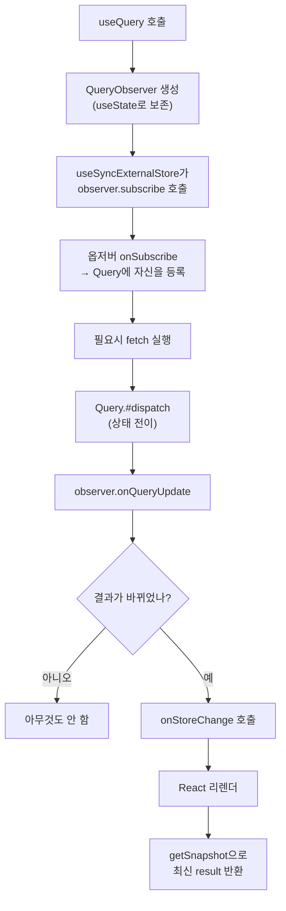

대부분의 사람들은 TanStack Query(구 React Query)를 '서버 데이터를 가져오는 훅' 정도로 사용합니다. `useQuery`에 키와 fetch 함수를 넘기면 `data`, `isPending`, `error`가 마법처럼 나오고, 캐싱과 리페치는 알아서 처리됩니다.

하지만 내부를 들여다보면 TanStack Query는 사실 **데이터 페칭 라이브러리가 아닙니다.** 그것은 *비동기 상태 관리자(async state manager)*이며, 그 핵심은 다음 세 가지의 조합으로 이루어진 정교한 구조물입니다.

- **정규화된 인메모리 캐시** (해시된 키 → 쿼리 객체의 `Map`)
- **옵저버 패턴** (캐시 항목과 컴포넌트를 잇는 구독 메커니즘)
- **리듀서 기반 상태 머신** (`dispatch`로 전이되는 쿼리 상태)

이 글에서는 `fetch`를 어떻게 호출하는지가 아니라, `useQuery`를 호출했을 때 라이브러리 내부에서 *무슨 일이 벌어지는지*를 저수준에서 추적합니다. 설명을 위해 실제 소스를 단순화한 코드를 사용하지만, 구조와 이름은 v5 기준 실제 구현을 따릅니다.

## 계층 구조: 코어와 어댑터의 분리

가장 먼저 이해해야 할 것은 TanStack Query가 **프레임워크에 독립적**이라는 사실입니다. 라이브러리는 두 계층으로 나뉩니다.

```
@tanstack/query-core   ← 프레임워크 무관. 캐시, 쿼리, 옵저버, 리트라이어
        ↑
@tanstack/react-query  ← React 어댑터. useSyncExternalStore로 코어에 연결
@tanstack/vue-query    ← Vue 어댑터
@tanstack/solid-query  ← Solid 어댑터
```

`query-core`에는 React가 단 한 줄도 등장하지 않습니다. 캐시, 상태 머신, 리페치 로직, 가비지 컬렉션이 모두 순수 자바스크립트로 구현되어 있습니다. React 어댑터가 하는 일은 놀라울 만큼 얇습니다. **코어의 옵저버를 React의 렌더링 사이클에 연결하는 것**이 전부입니다.

이 분리를 머릿속에 두면 나머지가 훨씬 명확해집니다. "리액트 쿼리"라는 이름과 달리, 리액트는 가장 바깥의 얇은 껍데기일 뿐입니다.

## QueryClient: 모든 것의 컨테이너

`QueryClientProvider`에 넘기는 `QueryClient`는 단순한 설정 객체가 아니라 두 개의 캐시를 소유한 최상위 컨테이너입니다.

```typescript
class QueryClient {
  #queryCache: QueryCache;     // 모든 쿼리를 보관
  #mutationCache: MutationCache; // 모든 뮤테이션을 보관
  #defaultOptions: DefaultOptions;

  constructor(config = {}) {
    this.#queryCache = config.queryCache || new QueryCache();
    this.#mutationCache = config.mutationCache || new MutationCache();
    this.#defaultOptions = config.defaultOptions || {};
  }
}
```

여기서 핵심은 **상태가 React 트리 안에 있지 않다는 점**입니다. 캐시는 `QueryClient` 인스턴스 위에, 즉 React 바깥의 평범한 자바스크립트 객체에 존재합니다. 컴포넌트가 마운트/언마운트되어도 캐시는 그대로 살아있습니다. 이것이 컴포넌트를 떠났다가 돌아와도 데이터가 즉시 표시되는 이유입니다.

## QueryCache: 해시된 키로 정규화된 Map

`QueryCache`의 정체는 의외로 단순합니다. 그것은 **문자열로 직렬화된 쿼리 키를 키로 갖는 `Map`**입니다.

```typescript
class QueryCache extends Subscribable {
  #queries: Map<string, Query>;

  constructor() {
    super();
    this.#queries = new Map();
  }

  build(client, options) {
    const queryHash = hashKey(options.queryKey);
    let query = this.#queries.get(queryHash);

    if (!query) {
      query = new Query({
        client,
        queryKey: options.queryKey,
        queryHash,
        options,
      });
      this.#queries.set(queryHash, query);
    }

    return query;
  }
}
```

`['todos', { status: 'done' }]` 같은 배열 키는 `hashKey`를 통해 결정적(deterministic)인 문자열로 변환됩니다. 핵심은 객체의 키를 정렬한 뒤 직렬화한다는 점입니다.

```typescript
function hashKey(queryKey) {
  return JSON.stringify(queryKey, (_, val) =>
    isPlainObject(val)
      ? Object.keys(val)
          .sort()
          .reduce((result, key) => {
            result[key] = val[key];
            return result;
          }, {})
      : val,
  );
}
```

키를 정렬하기 때문에 `{ a: 1, b: 2 }`와 `{ b: 2, a: 1 }`은 동일한 해시를 만듭니다. 객체 속성의 순서와 무관하게 같은 캐시 항목을 가리키게 되는 것입니다. 이 해시가 바로 캐시의 정규화(normalization) 기준이며, `build`가 "있으면 재사용, 없으면 생성"으로 동작하기 때문에 **같은 키를 쓰는 여러 컴포넌트는 자동으로 동일한 `Query` 인스턴스를 공유**하게 됩니다.

## Subscribable: 옵저버 패턴의 토대

방금 `QueryCache extends Subscribable`이라는 코드를 봤습니다. `Subscribable`은 TanStack Query 전반에 깔려 있는 옵저버 패턴의 기본 클래스입니다. 코어 곳곳(`QueryCache`, `QueryObserver`, `focusManager`, `onlineManager`)이 이를 상속합니다.

```typescript
class Subscribable {
  protected listeners: Set<Listener>;

  constructor() {
    this.listeners = new Set();
  }

  subscribe(listener) {
    this.listeners.add(listener);
    this.onSubscribe();

    // 구독 해제 함수를 반환
    return () => {
      this.listeners.delete(listener);
      this.onUnsubscribe();
    };
  }

  hasListeners() {
    return this.listeners.size > 0;
  }

  protected onSubscribe(): void {}
  protected onUnsubscribe(): void {}
}
```

별것 아닌 듯 보이지만 이 작은 클래스가 전체 아키텍처의 척추입니다. `subscribe`가 *구독 해제 함수*를 반환한다는 점, 그리고 `onSubscribe`/`onUnsubscribe`라는 빈 훅을 제공한다는 점을 기억해 두세요. 뒤에서 가비지 컬렉션이 바로 이 `onUnsubscribe` 위에서 동작합니다.

## Query: 리듀서로 동작하는 상태 머신

이제 핵심인 `Query` 객체로 들어갑니다. 하나의 `Query`는 하나의 캐시 항목을 나타내며, 다음을 소유합니다.

- `state`: 현재 상태 스냅샷 (`data`, `error`, `status`, `fetchStatus`, `dataUpdatedAt` 등)
- `observers`: 이 쿼리를 지켜보는 옵저버 배열
- 진행 중인 `Retryer` (실제 fetch를 관리)
- 가비지 컬렉션 타이머

여기서 결정적으로 중요한 설계가 하나 있습니다. v5에서 쿼리의 상태는 **두 개의 직교하는 축**으로 표현됩니다.

```typescript
// status: 데이터가 있는가? (캐시 관점)
type Status = 'pending' | 'error' | 'success';

// fetchStatus: 지금 네트워크 요청 중인가? (실행 관점)
type FetchStatus = 'fetching' | 'paused' | 'idle';
```

왜 분리할까요? 이미 캐시된 데이터가 있는 상태(`status: 'success'`)에서 백그라운드 리페치가 일어날 수 있기 때문입니다. 이 경우 `status`는 `'success'`인 채로 `fetchStatus`만 `'fetching'`이 됩니다. 두 축을 하나로 합쳤다면 "데이터는 있지만 갱신 중"이라는 흔한 상태를 표현할 수 없었을 것입니다. (`paused`는 네트워크 오프라인 등으로 요청이 대기 중인 상태입니다.)

상태 전이는 직접적인 할당이 아니라 **리듀서를 통한 `dispatch`**로 이루어집니다. Redux를 본 적 있다면 익숙할 패턴입니다.

```typescript
class Query extends Removable {
  state: QueryState;
  #observers: QueryObserver[] = [];
  #retryer?: Retryer;

  // 모든 상태 변경은 이 한 곳을 통과한다
  #dispatch(action) {
    this.state = reducer(this.state, action);

    // 상태가 바뀌면 모든 옵저버와 캐시에 알린다
    notifyManager.batch(() => {
      this.#observers.forEach((observer) => {
        observer.onQueryUpdate();
      });
      this.#cache.notify({ query: this, type: 'updated', action });
    });
  }
}

function reducer(state, action) {
  switch (action.type) {
    case 'fetch':
      return {
        ...state,
        fetchStatus: 'fetching',
        // 첫 요청이면 pending, 재요청이면 기존 status 유지
        ...(!state.dataUpdatedAt && { status: 'pending' }),
      };
    case 'success':
      return {
        ...state,
        data: action.data,
        status: 'success',
        fetchStatus: 'idle',
        dataUpdatedAt: action.dataUpdatedAt,
        error: null,
      };
    case 'error':
      return {
        ...state,
        error: action.error,
        status: 'error',
        fetchStatus: 'idle',
        errorUpdatedAt: Date.now(),
      };
    // ...
  }
}
```

이 설계의 미덕은 **상태 변경의 단일 통로**가 존재한다는 것입니다. 어떤 경로로 데이터가 갱신되든 — 직접 fetch, `setQueryData`로 수동 갱신, 옵티미스틱 업데이트 — 결국 모두 `#dispatch`를 통과합니다. 그리고 `#dispatch`는 변경 후 항상 옵저버들에게 `onQueryUpdate()`를 호출합니다. 이것이 "캐시가 바뀌면 화면이 갱신된다"는 마법의 실체입니다.

## QueryObserver: 쿼리와 컴포넌트를 잇는 다리

`Query`는 캐시 항목이고, 컴포넌트는 그것을 보고 싶어 합니다. 둘을 잇는 것이 `QueryObserver`입니다. **`useQuery` 호출 하나당 `QueryObserver` 인스턴스 하나**가 생성됩니다.

옵저버의 역할은 단순한 전달자가 아닙니다. 옵저버는 다음을 책임집니다.

1. 자신이 관심 있는 `Query`를 구독한다.
2. 원시 쿼리 상태를 컴포넌트가 쓸 `result` 객체로 가공한다 (`select` 적용, `isPending`/`isFetching` 같은 파생 불리언 계산).
3. 결과가 *실제로 바뀌었을 때만* 컴포넌트에 알린다.

```typescript
class QueryObserver extends Subscribable {
  #currentQuery: Query;
  #currentResult: QueryObserverResult;

  // Subscribable의 훅: 첫 구독자가 생기면 호출됨
  protected onSubscribe() {
    if (this.listeners.size === 1) {
      this.#currentQuery.addObserver(this);

      // 마운트 시점에 리페치가 필요한지 판단
      if (shouldFetchOnMount(this.#currentQuery, this.options)) {
        this.#executeFetch();
      }
    }
  }

  protected onUnsubscribe() {
    if (this.listeners.size === 0) {
      this.#currentQuery.removeObserver(this);
    }
  }

  // Query가 #dispatch 안에서 호출하는 메서드
  onQueryUpdate() {
    this.#updateResult();
  }

  #updateResult() {
    const prevResult = this.#currentResult;
    const nextResult = this.createResult(this.#currentQuery, this.options);

    // 결과가 동일하면 알림을 보내지 않는다 → 불필요한 리렌더 방지
    if (shallowEqualObjects(nextResult, prevResult)) {
      return;
    }

    this.#currentResult = nextResult;
    this.#notify(); // 구독자(=컴포넌트)에게 알림
  }
}
```

`onSubscribe`에서 `this.listeners.size === 1` 조건을 확인하는 부분이 중요합니다. 옵저버가 *처음으로* 구독될 때, 즉 컴포넌트가 마운트될 때 비로소 자신을 `Query`에 등록하고 필요하면 리페치를 시작합니다. 그리고 `onUnsubscribe`에서 구독자가 0이 되면 자신을 `Query`에서 제거합니다. 컴포넌트의 생명주기가 옵저버의 구독으로, 옵저버의 구독이 다시 `Query`의 옵저버 목록으로 전파되는 구조입니다.

`#updateResult`의 `shallowEqualObjects` 비교도 핵심입니다. 백그라운드 리페치 결과 데이터가 이전과 같다면, 옵저버는 컴포넌트에 알림을 보내지 않습니다. 불필요한 리렌더링을 차단하는 첫 번째 방어선입니다.

## React 어댑터: useSyncExternalStore라는 접착제

이제 가장 얇은 계층, React 어댑터입니다. `useQuery`는 내부적으로 `useBaseQuery`를 호출하고, 그 핵심은 React 18의 `useSyncExternalStore`입니다.

```typescript
function useBaseQuery(options, Observer, queryClient) {
  const client = useQueryClient(queryClient);

  // 옵저버는 렌더 사이에 보존되어야 한다
  const [observer] = useState(
    () => new Observer(client, options),
  );

  // 외부 스토어(옵저버)를 React에 구독시킨다
  const result = useSyncExternalStore(
    useCallback(
      (onStoreChange) => {
        // 옵저버 구독 → 변경 시 onStoreChange가 React 리렌더를 유발
        const unsubscribe = observer.subscribe(onStoreChange);
        return unsubscribe;
      },
      [observer],
    ),
    () => observer.getCurrentResult(), // getSnapshot
    () => observer.getCurrentResult(), // getServerSnapshot
  );

  // 옵션이 바뀌면 옵저버에 반영 (렌더 중)
  observer.setOptions(options);

  return result;
}
```

흐름을 정리하면 이렇습니다.



`useSyncExternalStore`는 정확히 이런 용도로 React 18에 추가된 API입니다. "React 바깥에 있는 변경 가능한 스토어를 안전하게(테어링 없이) 구독"하는 것 말입니다. TanStack Query의 캐시야말로 전형적인 외부 스토어이므로 완벽하게 들어맞습니다. 어댑터가 이토록 얇을 수 있는 이유가 여기 있습니다.

## notifyManager: 알림 배칭

`Query.#dispatch`에서 `notifyManager.batch(...)`로 옵저버들에게 알림을 보냈던 것을 기억하시나요? 만약 한 번의 작업이 여러 쿼리를 갱신한다면(예: `invalidateQueries`로 10개 쿼리를 무효화), 알림이 10번 따로 발생하고 그때마다 React가 리렌더된다면 비효율적입니다.

`notifyManager`는 이 알림들을 모았다가 한 번에 비웁니다.

```typescript
function createNotifyManager() {
  let queue = [];
  let transactions = 0;

  // 배치 스케줄러: 기본은 마이크로태스크에서 flush
  let scheduleFn = (cb) => queueMicrotask(cb);

  function batch(callback) {
    let result;
    transactions++;
    try {
      result = callback();
    } finally {
      transactions--;
      if (transactions === 0) {
        flush();
      }
    }
    return result;
  }

  function schedule(callback) {
    if (transactions > 0) {
      queue.push(callback); // 배치 중이면 큐에 모은다
    } else {
      scheduleFn(() => callback()); // 아니면 다음 틱에 실행
    }
  }

  function flush() {
    const originalQueue = queue;
    queue = [];
    if (originalQueue.length) {
      scheduleFn(() => {
        originalQueue.forEach((callback) => callback());
      });
    }
  }

  return { batch, schedule, setScheduler: (fn) => { scheduleFn = fn; } };
}
```

`batch` 안에서 일어나는 모든 알림은 큐에 쌓였다가, 배치가 끝나는 시점에 한꺼번에 flush됩니다. 결과적으로 여러 쿼리가 동시에 갱신되어도 React 리렌더는 최소한으로 묶입니다. `setScheduler`가 주입 가능하다는 점도 흥미롭습니다 — 과거 React 17 시절에는 여기에 `ReactDOM.unstable_batchedUpdates`를 꽂아 배칭을 강제했습니다.

## Retryer: fetch의 생명주기 관리자

실제 fetch를 호출하는 주체는 `Query`가 아니라 `Retryer`라는 별도 객체입니다. 단순히 `queryFn()`을 호출하는 게 아니라, 재시도·취소·일시정지(네트워크 모드)라는 복잡한 생명주기를 캡슐화합니다.

```typescript
function createRetryer(config) {
  let isRetryCancelled = false;
  let failureCount = 0;
  let continueFn; // 일시정지된 요청을 재개하는 함수

  const promise = new Promise((outerResolve, outerReject) => {
    const resolve = (value) => { /* ... */ outerResolve(value); };
    const reject = (error) => { /* ... */ outerReject(error); };

    const run = () => {
      let promiseOrValue;
      try {
        promiseOrValue = config.fn(); // 실제 queryFn 호출
      } catch (error) {
        promiseOrValue = Promise.reject(error);
      }

      Promise.resolve(promiseOrValue)
        .then(resolve)
        .catch((error) => {
          // 재시도 여부 판단
          const retry = config.retry ?? 3;
          const shouldRetry =
            failureCount < resolveValue(retry, failureCount, error);

          if (isRetryCancelled || !shouldRetry) {
            reject(error);
            return;
          }

          failureCount++;
          config.onFail?.(failureCount, error);

          // 백오프 지연 후 재시도. 단, 오프라인이면 여기서 pause
          sleep(backoffDelay(failureCount, config.retryDelay))
            .then(() => (canFetch(config.networkMode) ? undefined : pause()))
            .then(() => {
              if (isRetryCancelled) reject(error);
              else run(); // 재귀적으로 재시도
            });
        });
    };

    run();
  });

  return { promise, cancel, continue: () => continueFn?.() };
}
```

여기서 두 가지를 주목할 만합니다.

**첫째, 재시도는 재귀입니다.** `run()`이 실패하면 백오프 지연 후 자기 자신을 다시 호출합니다. `failureCount`는 클로저에 갇혀 호출 간에 유지됩니다. 백오프는 기본적으로 지수 증가(`2 ** failureCount * 1000`, 최대 30초)를 따릅니다.

**둘째, fetch는 일시정지될 수 있습니다.** `networkMode`가 `'online'`(기본값)일 때 네트워크가 오프라인이면, 요청은 실패하는 대신 `pause()` 상태로 들어가 `continueFn`을 클로저에 저장합니다. 나중에 온라인이 복귀하면 `continue()`가 호출되어 정확히 멈췄던 지점부터 재개됩니다. 이 메커니즘이 `fetchStatus: 'paused'`의 정체입니다.

## focusManager와 onlineManager: 환경을 감지하는 싱글톤

"창에 포커스가 돌아오면 자동 리페치", "오프라인이었다가 온라인이 되면 재개" 같은 기능은 어디서 올까요? 두 개의 전역 싱글톤, `focusManager`와 `onlineManager`입니다. 둘 다 앞서 본 `Subscribable`을 상속합니다.

```typescript
class FocusManager extends Subscribable {
  #focused?: boolean;
  #cleanup?: () => void;

  // 첫 구독자가 생길 때만 실제 이벤트 리스너를 단다
  protected onSubscribe() {
    if (!this.#cleanup) {
      this.setEventListener((onFocus) => {
        const listener = () => onFocus();
        window.addEventListener('visibilitychange', listener, false);
        return () => window.removeEventListener('visibilitychange', listener);
      });
    }
  }

  setFocused(focused) {
    const changed = this.#focused !== focused;
    if (changed) {
      this.#focused = focused;
      // 모든 구독자(=QueryCache 등)에게 알림
      this.listeners.forEach((listener) => listener(focused));
    }
  }
}

export const focusManager = new FocusManager(); // 전역 싱글톤
```

`onlineManager` 역시 같은 패턴으로 `online`/`offline` 이벤트를 감지합니다. 이 매니저들이 포커스/온라인 복귀를 감지하면, 구독 중인 옵저버들이 자신의 `refetchOnWindowFocus` / `refetchOnReconnect` 옵션과 staleness를 확인한 뒤 필요하면 리페치를 트리거합니다. 환경 감지 로직이 쿼리 로직과 깔끔하게 분리되어 있고, 테스트나 React Native 환경에서 `setEventListener`로 동작을 쉽게 교체할 수 있는 이유입니다.

## staleTime vs gcTime: 두 개의 다른 시계

초보자가 가장 혼동하는 두 옵션인데, 내부 구조를 알면 명확해집니다. **둘은 완전히 다른 두 개의 시계를 제어합니다.**

**`staleTime`** — 데이터가 "신선한지(fresh)" 판단하는 시간입니다. 데이터가 fresh인 동안에는 새 옵저버가 마운트되거나 창에 포커스가 돌아와도 리페치하지 않습니다. staleness 판단은 단순한 시간 비교입니다.

```typescript
class Query {
  isStale() {
    return (
      this.state.isInvalidated ||
      !this.state.dataUpdatedAt ||
      this.#observers.some((o) => o.getCurrentResult().isStale)
    );
  }

  isStaleByTime(staleTime = 0) {
    return (
      !this.state.dataUpdatedAt ||
      Date.now() - this.state.dataUpdatedAt >= staleTime
    );
  }
}
```

**`gcTime`** (v5에서 `cacheTime`을 개명) — 옵저버가 0개인 쿼리를 캐시에서 제거하기까지 기다리는 시간입니다. 이것은 `Removable` 기반 클래스에 구현된 별도의 타이머입니다.

```typescript
class Removable {
  #gcTimeout?: ReturnType<typeof setTimeout>;
  gcTime = 5 * 60 * 1000; // 기본 5분

  // 옵저버가 0이 될 때 호출됨
  scheduleGc() {
    this.clearGcTimeout();
    this.#gcTimeout = setTimeout(() => {
      this.optionalRemove(); // 캐시에서 자신을 제거
    }, this.gcTime);
  }

  clearGcTimeout() {
    if (this.#gcTimeout) {
      clearTimeout(this.#gcTimeout);
      this.#gcTimeout = undefined;
    }
  }
}
```

흐름을 따라가 봅시다. 컴포넌트가 언마운트되면 → 옵저버의 `onUnsubscribe`가 호출되고 → `Query.removeObserver`가 실행됩니다. 이때 옵저버가 0개가 되면 `Query`는 `scheduleGc()`로 5분짜리 자기 파괴 타이머를 켭니다. 만약 5분 안에 같은 키의 컴포넌트가 다시 마운트되면 `addObserver`가 `clearGcTimeout()`을 호출해 타이머를 끄고, 데이터는 살아남습니다. 5분이 지나도록 아무도 돌아오지 않으면 비로소 `Map`에서 제거됩니다.

정리하면:

| | `staleTime` | `gcTime` |
|---|---|---|
| 무엇을 결정하나 | 데이터가 fresh인가 stale인가 | 옵저버 없는 쿼리를 언제 버릴까 |
| 타이머 시작 시점 | 데이터 갱신 시각 기준 비교 | 옵저버가 0이 될 때 |
| 효과 | 리페치 여부 | 메모리에서 제거 여부 |
| 기본값 | `0` (항상 stale) | `5분` |

`staleTime`은 "언제 다시 가져올까"를, `gcTime`은 "언제 잊을까"를 다룹니다. fresh한데 옵저버가 없을 수도, stale한데 옵저버가 있을 수도 있습니다 — 두 시계는 독립적으로 돕니다.

## Structural Sharing: 참조 동일성의 보존

마지막으로, 성능에 결정적인 디테일 하나. fetch 결과 데이터의 *내용*이 이전과 같다면, TanStack Query는 새 객체를 만드는 대신 **기존 객체의 참조를 유지**합니다. 이를 structural sharing이라 부르며 `replaceEqualDeep`이 담당합니다.

```typescript
function replaceEqualDeep(prev, next) {
  if (prev === next) return prev;

  const array = Array.isArray(prev) && Array.isArray(next);
  if (array || (isPlainObject(prev) && isPlainObject(next))) {
    let equalItems = 0;
    const copy = array ? [] : {};
    const keys = array ? next : Object.keys(next);
    const length = keys.length;

    for (let i = 0; i < length; i++) {
      const key = array ? i : keys[i];
      // 재귀적으로 깊이 비교하며 같은 부분은 이전 참조를 재사용
      copy[key] = replaceEqualDeep(prev[key], next[key]);
      if (copy[key] === prev[key]) equalItems++;
    }

    // 모든 키가 동일하면 아예 이전 객체를 그대로 반환
    return prev.length === length && equalItems === length ? prev : copy;
  }

  return next;
}
```

왜 이게 중요할까요? React에서 `useMemo`, `useEffect`의 의존성 배열, `React.memo`는 모두 참조 동일성(`===`)으로 변화를 판단합니다. fetch 결과가 매번 새 객체라면, 데이터 내용이 동일해도 이 최적화들이 전부 무력화됩니다. structural sharing은 "내용이 같으면 참조도 같게" 만들어 다운스트림의 메모이제이션이 제대로 작동하도록 보장합니다. 응답의 일부만 바뀌었다면 바뀐 가지의 참조만 새로 만들고 나머지는 그대로 둡니다.

## 전체 그림: 하나의 멘탈 모델로

이제 처음 던진 질문 — "`useQuery`를 호출하면 무슨 일이 벌어지는가" — 에 한 문장으로 답할 수 있습니다.

> `useQuery`는 **QueryObserver**를 만들어 React 바깥의 **QueryCache** 속 **Query** 객체를 `useSyncExternalStore`로 구독하고, 이 Query는 **Retryer**로 fetch를 실행해 **리듀서/dispatch**로 상태를 전이시키며, 변경은 **notifyManager**의 배칭을 거쳐 옵저버에게 전달되고, 옵저버는 결과가 실제로 바뀌었을 때만 컴포넌트를 리렌더링한다. 그동안 **focusManager/onlineManager**는 환경 변화에 따른 리페치를, **staleTime**은 갱신 시점을, **gcTime**은 망각 시점을 각각 관장한다.

TanStack Query의 우아함은 화려한 알고리즘이 아니라 **책임의 분리**에 있습니다. 캐시는 저장만, Query는 상태 전이만, Observer는 구독과 결과 가공만, Retryer는 fetch 생명주기만, 매니저들은 환경 감지만 담당합니다. 그리고 이 모든 순수 자바스크립트 조각들을 React에 잇는 것은 `useSyncExternalStore` 단 하나입니다.

다음에 `useQuery`를 쓸 때, 그것이 단순한 데이터 페칭 훅이 아니라 정규화된 캐시 위에서 동작하는 옵저버 패턴 기반의 비동기 상태 머신이라는 점을 떠올려 보시기 바랍니다. 그 관점에서 보면 `staleTime`, `gcTime`, `enabled`, `select` 같은 옵션들이 왜 그렇게 동작하는지가 비로소 자연스럽게 이해될 것입니다.
