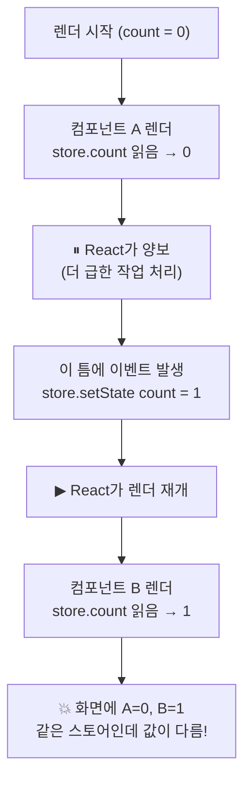

이전 글에서 TanStack Query가 React 바깥의 캐시를 컴포넌트에 잇는 방법으로 `useSyncExternalStore` 단 하나를 쓴다고 했습니다. 그리고 "정확히 이런 용도로 React 18에 추가된 API"라며 가볍게 넘어갔습니다. 이번 글은 바로 그 문장을 정면으로 파고듭니다.

자연스러운 의문이 하나 있습니다. **외부 스토어를 구독하는 건 `useState`와 `useEffect`만으로도 되지 않나?** 실제로 React 17 시절 수많은 상태 관리 라이브러리가 그렇게 만들어졌습니다. 그런데 React 18은 굳이 새로운 훅을, 그것도 `useSyncExternalStore`라는 다소 투박한 이름으로 추가했습니다. 무언가 *기존 방식으로는 풀 수 없는 문제*가 생겼다는 뜻입니다.

그 문제의 이름이 **tearing(찢어짐)**입니다.

## 순진한 방식: useState + useEffect

외부 스토어를 구독하는 가장 직관적인 방법부터 봅시다. 스토어는 React 바깥에 있는, 구독 가능한 평범한 객체라고 하겠습니다.

```typescript
// React 바깥의 외부 스토어
const store = {
  state: { count: 0 },
  listeners: new Set(),
  subscribe(listener) {
    this.listeners.add(listener);
    return () => this.listeners.delete(listener);
  },
  getState() {
    return this.state;
  },
  setState(next) {
    this.state = next;
    this.listeners.forEach((l) => l()); // 모든 구독자에게 알림
  },
};
```

이걸 컴포넌트에서 쓰려면, 흔히 다음과 같은 커스텀 훅을 만듭니다.

```typescript
function useStore() {
  const [state, setState] = useState(store.getState());

  useEffect(() => {
    // 마운트 후 구독, 변경되면 로컬 state를 갱신해 리렌더 유발
    const unsubscribe = store.subscribe(() => {
      setState(store.getState());
    });
    return unsubscribe;
  }, []);

  return state;
}
```

React 17까지는 이 코드가 (대체로) 잘 동작했습니다. 그런데 React 18에서 `startTransition`이나 Suspense 같은 **동시성 기능(concurrent features)**을 켜는 순간, 이 패턴은 미묘하게 깨지기 시작합니다. 왜 그런지 이해하려면 먼저 React 18이 렌더링을 다루는 방식이 근본적으로 어떻게 바뀌었는지 알아야 합니다.

## 동시성 렌더링: 렌더는 더 이상 원자적이지 않다

React 17까지의 렌더링은 **동기적(synchronous)이고 중단 불가능(uninterruptible)**했습니다. 한번 렌더가 시작되면, 컴포넌트 트리 전체를 한 호흡에 끝까지 그려냈습니다. 그 사이에 다른 자바스크립트 코드가 끼어들 틈이 없었습니다. 렌더는 사실상 하나의 원자적 작업이었던 셈입니다.

React 18의 동시성 렌더링은 이 전제를 깹니다. **렌더링은 이제 잘게 쪼개져(time slicing) 중단되고 재개될 수 있습니다.** React는 긴 렌더 작업을 작은 단위로 나눠 처리하다가, 더 급한 일(예: 사용자 입력)이 생기면 진행 중이던 렌더를 *잠시 멈추고* 브라우저에 제어권을 양보했다가, 나중에 다시 *이어서* 그립니다.

```
[React 17] 렌더 시작 ████████████████ 렌더 끝   (중단 없음)

[React 18] 렌더 시작 ████░░░░████░░████ 렌더 끝
                         ↑       ↑
                    여기서 양보   여기서 양보
                  (다른 코드가 실행될 수 있음!)
```

바로 이 "양보하는 틈"이 문제의 근원입니다. 렌더가 중단된 사이에 이벤트 핸들러나 타이머가 실행되어 **외부 스토어의 값을 바꿔버릴 수 있기 때문**입니다.

## Tearing: 한 화면에 두 개의 진실

구체적인 시나리오로 그려보겠습니다. `store.count`가 `0`이고, 이 값을 읽는 컴포넌트 `<A>`와 `<B>`가 같은 트리에 있다고 합시다. React 18이 동시성 모드로 이 트리를 렌더하는 도중입니다.



`<A>`는 렌더 도중 `store.count`를 `0`으로 읽었습니다. 그런데 React가 양보한 틈에 스토어가 `1`로 바뀌었고, 재개된 뒤 `<B>`는 같은 `store.count`를 `1`로 읽습니다. **결과적으로 한 번의 렌더 패스 안에서, 동일한 외부 데이터를 두 컴포넌트가 서로 다른 값으로 그리게 됩니다.** 화면이 일관성을 잃고 "찢어지는" 것 — 이것이 tearing입니다.

React 17에서는 렌더가 중단되지 않았으므로 이런 일이 원천적으로 불가능했습니다. 트리 전체가 항상 같은 스토어 값으로 그려졌습니다. tearing은 동시성 렌더링이 가져온 **새로운 종류의 버그**인 것입니다.

`useState + useEffect` 방식이 깨지는 이유가 여기 있습니다. 그 패턴은 스토어 값을 React의 로컬 state로 *복사*해 두는데, 동시성 렌더 중에는 이 복사본과 실제 스토어가 어긋날 수 있고, React는 그 어긋남을 알아챌 방법이 없습니다.

## useSyncExternalStore의 계약

`useSyncExternalStore`는 이 문제를 해결하기 위해 설계되었습니다. 시그니처는 세 개의 인자를 받습니다.

```typescript
const snapshot = useSyncExternalStore(
  subscribe,         // (onStoreChange) => unsubscribe
  getSnapshot,       // () => 현재 스냅샷
  getServerSnapshot? // () => SSR/하이드레이션용 스냅샷 (선택)
);
```

앞의 순진한 훅을 이걸로 다시 쓰면 이렇게 됩니다.

```typescript
function useStore() {
  return useSyncExternalStore(
    (onStoreChange) => store.subscribe(onStoreChange),
    () => store.getState(),
  );
}
```

코드는 더 짧아졌는데, 중요한 건 이름에 박힌 단어 **`Sync`**입니다. 이 훅은 React에게 다음과 같이 선언하는 것과 같습니다.

> "이 값은 React 바깥의 가변 스토어에서 온다. 이 스토어가 바뀌어서 발생하는 업데이트는 **동시성 기능(time slicing)에서 제외하고, 동기적으로 처리하라.**"

즉, 스토어 변경으로 인한 리렌더는 잘게 쪼개거나 중단하지 않고 한 호흡에 끝냅니다. 그러면 그 렌더 패스 동안 스토어 값이 중간에 바뀔 틈이 없으므로, 트리 전체가 일관된 값으로 그려집니다. **동시성의 이점을 일부 포기하는 대신 일관성을 보장하는 트레이드오프**입니다.

## tearing을 잡아내는 두 번째 방어선

스토어 자체의 변경을 동기 처리하는 것만으로는 부족합니다. *다른* 상태 변화 때문에 시작된 동시성 렌더가 진행되는 도중에 스토어가 바뀔 수도 있기 때문입니다. 이를 위해 `useSyncExternalStore`에는 **tearing 검사**가 한 겹 더 있습니다.

핵심 아이디어는 이렇습니다. 렌더 중에 읽은 스냅샷을 기억해 두었다가, **커밋 직전에 `getSnapshot`을 다시 호출해 값이 그대로인지 확인**하는 것입니다.

```typescript
// 실제 구현을 극도로 단순화한 멘탈 모델
function useSyncExternalStore(subscribe, getSnapshot) {
  // 렌더 중에 읽은 값
  const value = getSnapshot();

  // React는 이 value를 기억해 두었다가...
  useLayoutEffect(() => {
    // 커밋 시점에 다시 읽어, 렌더 때와 달라졌는지 확인
    if (!Object.is(value, getSnapshot())) {
      // 달라졌다면 tearing이 발생한 것 → 강제로 재렌더
      forceRerender();
    }

    // 그리고 구독을 건다
    return subscribe(() => {
      // 변경 알림이 오면, 역시 스냅샷을 비교해 필요시 재렌더
      if (!Object.is(value, getSnapshot())) {
        forceRerender();
      }
    });
  }, [subscribe, value]);

  return value;
}
```

만약 렌더 도중 스토어가 바뀌어 tearing이 발생했다면, 커밋 직전 검사에서 "렌더 때 읽은 값 ≠ 지금 값"이 감지되고, React는 그 결과를 버린 뒤 **최신 값으로 다시 렌더**합니다. 사용자는 찢어진 중간 상태를 결코 보지 못합니다. 이 검사가 동시성 렌더 중에도 외부 스토어의 일관성을 보장하는 안전망입니다.

또 하나 짚을 점은 `useEffect`가 아니라 `useLayoutEffect` 계열의 타이밍으로 구독한다는 것입니다. `useEffect`는 브라우저가 화면을 그린 *후에* 실행되므로, 그 사이(렌더 완료~effect 실행)에 스토어가 바뀌면 알림을 놓칠 수 있습니다. 순진한 `useState + useEffect` 패턴이 가진 또 다른 빈틈인데, `useSyncExternalStore`는 더 이른 시점에 구독하고 스냅샷을 재확인함으로써 이 누락 창(window)을 닫습니다.

## getSnapshot은 반드시 캐시되어야 한다

`useSyncExternalStore`를 쓰다 보면 거의 누구나 한 번은 마주치는 함정이 있습니다. 콘솔의 경고, 혹은 무한 렌더 루프입니다.

> The result of getSnapshot should be cached to avoid an infinite loop

원인은 `getSnapshot`의 반환값을 React가 `Object.is`로 비교한다는 데 있습니다. 위 멘탈 모델에서 봤듯 React는 "렌더 때 값"과 "다시 읽은 값"이 같은지 끊임없이 비교합니다. 그런데 `getSnapshot`이 호출될 때마다 **새 객체를 만들어 반환**하면, 내용이 같아도 참조가 매번 달라 `Object.is`가 항상 `false`를 반환합니다. React는 "스토어가 또 바뀌었네" → 재렌더 → 또 새 객체 → 또 바뀜… 무한 루프에 빠집니다.

```typescript
// 잘못된 예: 호출할 때마다 새 배열/객체 생성
function getSnapshot() {
  return store.items.filter((i) => i.active); // 매번 새 배열!
}

// 잘못된 예: 매번 새 객체 리터럴
function getSnapshot() {
  return { count: store.count, name: store.name }; // 매번 새 객체!
}
```

원칙은 단순합니다. **스토어가 실제로 바뀌지 않았다면 `getSnapshot`은 동일한 참조를 반환해야 합니다.** 스토어 내부 상태를 그대로 반환하거나, 파생값이 필요하다면 메모이즈해서 캐시된 참조를 돌려줘야 합니다.

```typescript
// 올바른 예: 스토어가 관리하는 캐시된 참조를 그대로 반환
function getSnapshot() {
  return store.getState(); // setState 때만 새 참조가 만들어짐
}
```

이전 글에서 본 TanStack Query의 structural sharing(`replaceEqualDeep`)이 왜 그토록 중요한지 여기서 다시 연결됩니다. 옵저버의 `getCurrentResult()`가 곧 `getSnapshot` 역할을 하는데, 내용이 같으면 참조도 같게 유지해주는 structural sharing이 바로 이 "캐시된 스냅샷" 계약을 만족시키는 장치인 것입니다. 파생값을 다뤄야 할 때는 공식 패키지가 제공하는 `useSyncExternalStoreWithSelector`를 쓰는데, 이것 역시 셀렉터 결과를 비교·캐시해 같은 함정을 피합니다.

## getServerSnapshot: 서버에는 구독이 없다

세 번째 인자 `getServerSnapshot`은 SSR과 하이드레이션을 위한 것입니다. 서버에는 구독할 대상도, 변경 알림도 없습니다. 시간에 따라 변하는 클라이언트 스토어를 서버 렌더에 그대로 쓰면, 서버가 그린 HTML과 클라이언트의 첫 렌더 결과가 어긋나는 **하이드레이션 불일치(hydration mismatch)**가 발생합니다.

`getServerSnapshot`은 서버 렌더와 클라이언트의 하이드레이션 단계에서 사용할, 결정적인(deterministic) 초기 스냅샷을 제공합니다. 이렇게 양쪽이 같은 출발점을 공유하게 만든 뒤, 하이드레이션이 끝나고 나서 실제 구독과 클라이언트 스냅샷으로 전환합니다. 브라우저 전용 값(예: `window` 크기)을 다룰 때 특히 중요한 안전장치입니다.

## 정리: 왜 새로운 훅이 필요했나

처음의 질문으로 돌아갑시다. "외부 스토어 구독은 `useState + useEffect`로도 되지 않나?"

답은 **"동기 렌더링 시대에는 됐지만, 동시성 렌더링 시대에는 안 된다"**입니다. 동시성 렌더링이 렌더의 원자성을 깨뜨리면서, 외부의 가변 스토어를 안전하게 읽는 일이 더 이상 자명하지 않게 되었습니다. `useSyncExternalStore`는 이 새로운 환경에서:

- **스토어발 업데이트를 동기 처리**해 렌더 중 값이 바뀌는 것을 막고,
- **렌더-커밋 간 스냅샷을 재비교**해 tearing을 감지·복구하며,
- **이른 시점에 구독**해 알림 누락 창을 닫고,
- **`getServerSnapshot`으로 SSR 일관성**까지 챙깁니다.

그 대가로 우리에게 요구하는 단 하나의 규율은 "**`getSnapshot`은 변하지 않았으면 같은 참조를 반환하라**"는 것뿐입니다.

TanStack Query, Zustand, Redux, Jotai 같은 라이브러리들이 React 18 대응으로 일제히 내부 구독 메커니즘을 `useSyncExternalStore`로 교체한 이유가 바로 이것입니다. 이들은 모두 "React 바깥에 사는 가변 상태"를 다루며, 동시성 렌더링과 공존하려면 tearing을 막아야 하기 때문입니다. 이름은 투박하지만, 이 훅은 React가 동시성이라는 새 능력을 얻으면서 치러야 했던 비용을 라이브러리 저자들이 안전하게 지불할 수 있도록 마련해 둔, 작지만 결정적인 계약입니다.
